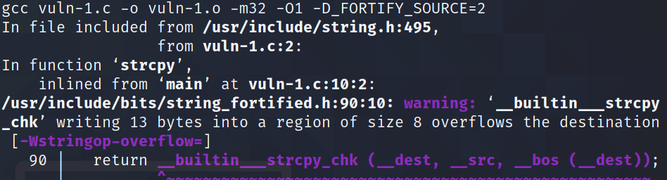
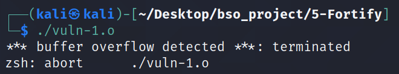
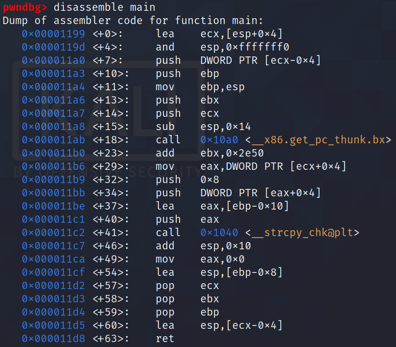
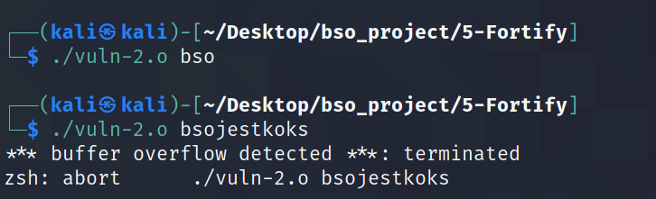
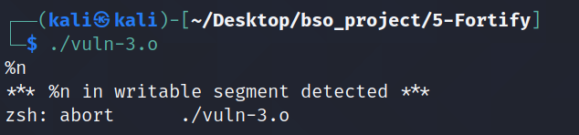
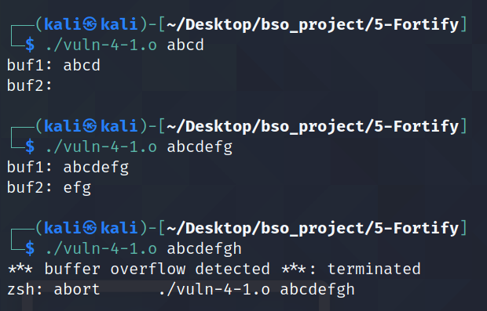
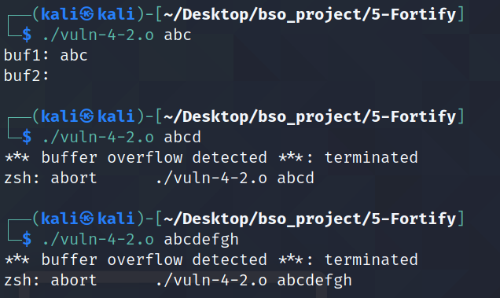

# Fortify

## 1. Opis

`FORTIFY_SOURCE` jest to technika zapewniająca wykrywanie przepełnienie buffora w funkcjach, które operują na pamięci i stringach czyli np. memcpy, memset, stpcpy, strcpy, strncpy, strcat, strncat, sprintf, snprintf, vsprintf, vsnprintf lub gets. Wykrywanie potencjalnych przepełnień buffora może odbywać się podczas kompilacji (wówczas uzyskamy warning) lub podczas trwania programu `run-time` (wówczas dostajemy błedy typu stack smash protection). Technika ta została wporwadzona w `glibc 2.3.4`.

Glibc zapewnie wiele wrapperów funkcji, które są niebezpieczne lecz przyjmują jako jeden ze swoich argumentów długość buffora. Przykłądem może być funkcja `__memcpy_chk()`, która to jest wrapperem dla funkcji `memcpy()` - funkcja niebezpieczna, nie sprawdza czy zachodzi overflow.

```c
 __memcpy_chk(void * dest, const void * src, size_t len, size_t destlen)
```

Funkcja ta działa jak zwykłe `memcpy()`, z wyjątkiem tego że sprawdzane jest czy buffer do którego chcemy zapisać dane pomieści dane dostarczane. Jeżeli taka niebezpieczna sytuacja nastąpi, wówczas funkcja przerywa wykonanie co wskazuje na to, że mógł wystąpić buffer overflow. Funkcje takie jak `__memcpy_chk()` nie powinny być wołane przez użytkownika, używane są one przez fortify_source. Kompilator decyduje o tym kiedy taką funkcję zastosować - stosują ją jeżeli nie jest w stanie stwierdzić, czy funkcja posiada błąd (np. istnieje możliwośc nadpisania jakiegoś buffora). Funkcja taka jak wyżej przedstawiona zapewniają ochronę w trakcie działania programu - `run time`.


W funcjach do sprawdzania wielkości buffora używana jest funkcja `__builtin_object_size (ptr, subobject_p)`. Oblicza ona ilość bajtów danej struktury. Jeżeli natomiast wielkość struktury nie jest znana podczas kompilacji  zwracaną wartością jest `(size_t) - 1`. 


## 2. Wydajność

Jest to technika, która może zwiększyć ilość kodu. Związane jest to oczywiscie z dodatkowymi wrapperami funkcji i dodatkowymi sprawdzaniami zapewniającymi bezpieczeństwo. Ilość dodatkowego kodu zalezy jednak od kodu jaki kompilujemy, używanych funkcji oraz poziomu zabezpieczenia ` __FORTIFY_SOURCE`.

Fortify nie wpływa negatywnie na performance apliakcji. Co więcej, stosowanie tej metody może wpłynąć pozytywnie na wydajność. [Test wydajnośći ](https://zatoichi-engineer.github.io/2017/10/06/fortify-source.html)


## 3. GCC i Clang


W obu przypadkach aby skompilować aplikację z fortify należy użyć flagi ` -D_FORTIFY_SOURCE={1,2}`, gdzie 1,2 to poziomy zabezpieczenia. Należy również kompilować taki program z właczoną optymalizacją - większą lub równią `-01`.

Jeżeli `_FORTIFY_SOURCE` jest ustawiony jako `1` z optymalizacją kodu `-01` lub wyżej, wszelkie sprawdzenia ochraniajace przed wystąpieniem buffer overflow nie powinny wpłynąć na zachowanie programu.

Natomiast jeżeli  `_FORTIFY_SOURCE` jest ustawiony jako `2` z optymalizacją kodu `-01` lub wyżej, sprawdzenia zapewniające ochornę mogą sprawić, że program nie będzie zachowywać się już tak jak z wyłączonym zabezpieczeniem. Przykładem może być zapisywanie do structa - przykład znajduje się niżej.

## 4. Działanie Fortify

Ze wględu na to, że Fortify zapewnia wiele rodzajów zabezpieczeń postanowiłem przedstawić je w kliku punktach. Do każdego punktu będzie dołączona inna aplikacja.

W tym przyapdku flagi kompilacji oprócz `-D_FORTIFY_SOURCE` nie mają znaczenia, gdyż chcę skupić się na omawianym zabezpieczeniu.

## 4.1 Ochrona compile-time  

------------
Pliki:
* vuln-1.c
-------------

```c
#include <stdio.h>
#include <string.h>

#define N 8


int main(int argc, char *argv[])
{
        char buffer [N];
        strcpy(buffer, "deadbeefface");
        return 0;
}
```


Jest to prosta aplikacja, w której od razu widać że nastepuje buffer overflow - string który chcemy zapisać do `buffer` jest większy niż dopuszczalna wartość. Dzięki temu, że aplikację kompilujemy z fortify dostajemy `warning` o tym, że wystąpił overflow.




Podcza próby uruchomienia programu dostajemy błąd `buffer overflow detected` - program jest od razu terminowany. 




## 4.2 Zamiana niebezpiecznych funkcji

----------
Pliki:
* vuln-2.c
--------------


```c
#include <stdio.h>
#include <string.h>

#define N 8


int main(int argc, char *argv[])
{
        char buffer [N];
        strcpy(buffer, argv[1]);
        return 0;
}
```


Aplikacja pokazana powyżej posiada błąd, do buffora jest kopiowwany argument o nieznanej długośći. Oznacza to, że może wystąpić buffer overflow. Jednakże, dzięki fortify funkcja ta zostanie zabezpieczona. W disassemble kodzie funkcji `main` widać, że została użyta funkcja wrapper.



Funkcja użyta to `__strcpy_chk@plt`. Funkcja ta sprawdza czy długość argumentu przekazywanego nie jest dłuższa niż buffora do którego chcemy coś zapisać. Jeżeli argument będzie dłuższy wówaczas dostajemy błąd `buffer overflow detected`, a program jest terminowany. Podobna sytuacja zachodzi w przypadku użycia innych niebezpiecznych funkcji - używany jest wówczas wrapper sprawdzający możliwość wystąpienia buffer overflow.





## 4.3 Format  string

------
Plik:
* vuln-3.c
-----

```c
#include <stdio.h>
#include <string.h>

int main(int argc, char *argv[])
{
        char buffer [8];
        gets(buffer);
        printf(buffer);
        return 0;
}
```


W tej apliakcji widać, że funkcja printf() stanowi duże niebezpieczeństwo, jest możliwość ataku typu format string (atak takiego typu w katalogu `4-Relro`). Jednakże dzięki temu, że używamy `fortify` w wersji `2` atak format string nie może mieć miejsca. Funkcja printf zostaje zastępiona odpowiednim wrapperem - w tym przyapdku jest to `__printf_chk@plt`. Funkcja ta sprawdza, czy w bufferze przekazanym do printf() nie znajdują się niebezpieczne modyfikator - `%n` (modyfikator ten jest w stanie pod wskazasny adres zapisać taką wartość, jaką printf wypisał na konsolę).

Przy próbie ataku format string podając `%n` funkcja wrapper dla printf() zauważa niebezpieczenstwo, i dostajemy błąd w postaci `%n in writable segment detected`, po czym program jest terminowany.



## 4.4 Zachowanie w przypadku struktur

--------
Pliki:
* vuln-4.c
--------


```c
#include <stdio.h>
#include <string.h>

#define N 4

struct A
{
        char buf1 [N];
        char buf2 [N];
} a;


int main(int argc, char *argv[])
{
        strcpy(a.buf1, argv[1]);
        printf("buf1: %s", a.buf1);
        putchar('\n');
        printf("buf2: %s", a.buf2);
        return 0;
}
```


W tym przypadku mamy strukturę, do której chcemy zapisać argument przekazywany przez konsolę. Omówię tutaj różnicę, pomiędzy poziomami zabezpieczenia przez `Fortify`.

W przypadku ustawienia `-D_FORTIFY_SOURCE=1` możliwe jest wystąpnie buffer overflow w obrębie struktury. Oznacza to, że w tym przypadku podczas próby zapisu do `buf1` o długości nie większej niż 7 znaków nie otrzymamy błędu (jest to 7 znaków gdyż należy pamietać o null byte). Poniżej znajduje się screen, który pokazuje, że przekazując do 7 znaków program zachowuje się poprawnie, tzn zapisywany jest również `buf2`. W przypadku podania większej ilości znaków program zwraca błąd `buffer overflow detected`.




Sytuacja zmienia się w przypadku ustawienia fortify na poziom drugi - `-D_FORTIFY_SOURCE=2`. Wówczas przepełnienia w obrębie struktury nie mogą mieć miejsca. Oznacza to, że w tym przypadku maksymalna długość argumentu który chcemy przekazać może mieć długość 3 (tutaj znowu należy pamietać o null byte). Poniżej znajduje się screen który pokazuje, że nie może wystąpić przepełnienie `buf1` oraz nie może wystącpić przepełnienie całej struktury. W przypadku podania większej ilości znaków zwracany jest błąd `buffer overflow detected` i program jest terminowany.




## 5. Podsumowanie

Sposób ochorny aplikacji poprzez użycie `Fortify_source` jest dobym sposobem. Nie powoduje spadku wydajnośći, lecz może zwiększyć wielkość kodu. Kluczowy jest fakt, że dzięki stosowaniu tej metody kompilator potrafi ostrzec przed możliwymi przepełnieniami buffora lub jeśli nie jest w stanie stwierdzić, czy tak a sytuacja może mieć miejsce stosuje swoje bezpieczniejszej funkcje. Według mnie, jest do dobry sposób ochorony i powinien być używany domyslnie.


### Źródła

* https://man7.org/linux/man-pages/man7/feature_test_macros.7.html
* https://gcc.gnu.org/legacy-ml/gcc-patches/2004-09/msg02055.html
* https://zatoichi-engineer.github.io/2017/10/06/fortify-source.html
* https://access.redhat.com/blogs/766093/posts/1976213
