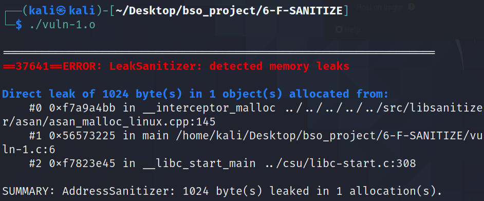
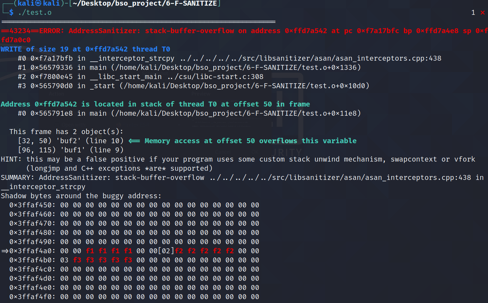
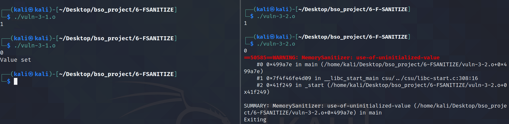
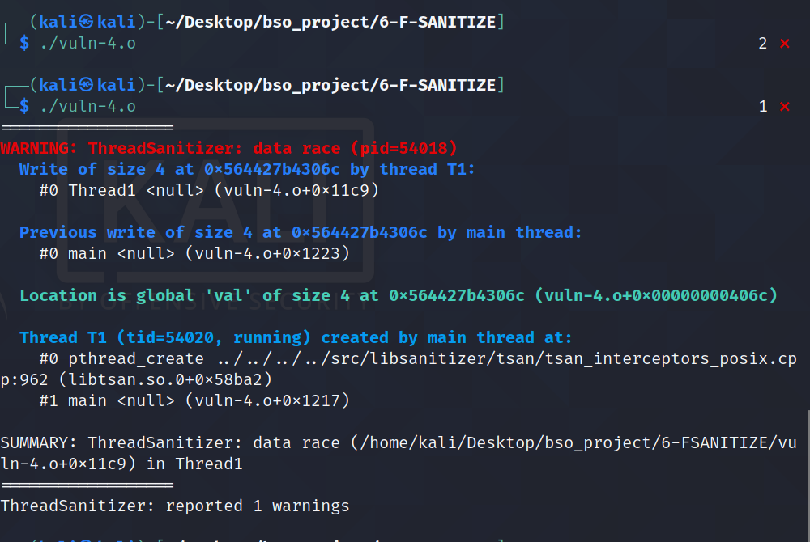
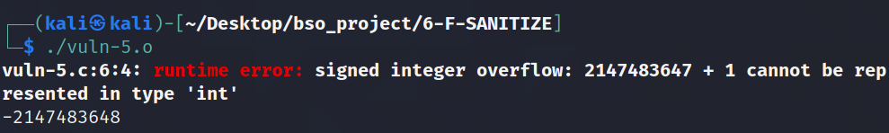

# Flaga -fsanitize

## 1. Opis

Często spotykanym problemem wśród programistów piszących w językach `C` lub `C++` są problemy z pamiecią - oczywiście wirtualną pamiecią. Odwoływanie się do niezainicjalizowanej pamięci, wycieki pamięci, nie zwolnianie pamięci to są najczęstrze problemy z którymi się borykamy. W celu zminimalizowania takich błedów powstało wiele narzędzi - jednym z popularniejszych jest `valgrind`, które działa pod systemem linux/macOs lub `Application Verifier` lub `WinDbg` pod systemem Windows.. Jednakże, kest to program który nalezy używać dopiero po skompilowaniu programu. Aby odnajdować błedy już podczas kompilacji oraz w trakcie pracy rogramu powstała dodatkowa opcja w kompilatorach o nazwie `-fsanitize`. Jest to narzędzie bardzo przydatne podczas debugu. Oczywiste jesto to, że tej flagi nie będzie sie uzywać na produkcji ani realase, jednakże podczas budowania kodu oraz jego testowania pozwala to na znalezienie wielu potecnalnych błędów.

Zdecydowaną zaletą używania sanitizer-ów nad valgrindem jest wydajność. Apliakcja ze skompilowanymi sanitizerem będzie zawsze szybsza niż odpalanie jej w narzedziu takim jak valgrind. Mówi się o 10x wolniejszym działaniu aplikacji z valgrind niż z sanitizerami. 

Ważne jest oczywiscie to, że do działania valgrinda nie potrzebujemy source-code, wystarczy jedynie binarka i na podstawie jej jesteśmy wstanie znaleźć błędy. Inaczej jest w przypadku sanitizerów, które to wymagania kodu źródłowego do kompilacji.

## 2. Gcc i Clang

Gcc oraz Clang mają swoje własne wersje implementacji sanitizerów. Clang ma bogatszą opcję wybóru - w przypadku kompilatora gcc brakuje flagi `-fsanitize=memor`. Pomimo różnic, użycie tej flagi w obu przypadkach działa na tej samej zasadzie, do podajemy flagę `-fsanitize=option`, z odpowiednią `option` jaka nas interesuje.


## 3.1 `-fsanitize=leak`

------ 
Plik:
* vuln-1.c
-------

```c
#include <stdio.h>
#include <stdlib.h>

int main(int argc, char** argv)
{
		char * buffer = malloc(1024);
		sprintf(buffer, "%d", argc);
		printf("%s",buffer);
		return EXIT_SUCCESS;
}
```


Powyżej znajduje się bardzo prosty oraz czesto wystepujący bład programistyczny. Alokujemy jeden kilobajt pamieci na stercie, po czym wykonujemy jakąs operację na tej pamięci. Brakuje jednak bardzo ważnej rzeczy - nie zwalniamy pamięci. Pamieć zostanie zwolniona dopiero po tym, jak program się zakończy.

Jak output z sanitizer-a dostajemy powiadomienie o wycieku pamięci. Na backtrace-sie widac dokładnie w którym miejscu miało to miejsce - w funkcji main w 6 linijce. Gdyby było więcej miejsc w którym zaszłą taka sytacja takich backtrace-ów byłoby więcej. Na samym końcu widzimy sumę pamięci która nie została zwolniona i w ilu miejscach to się stało.




## 3.2 `-fsanitize=address`

-------
Plik:
* vuln-2.c
-------


```c
#include <stdio.h>
#include <stdlib.h>
#include <string.h>

#define N 18

int main(void)
{
        const char buf1 [] = "Test of sanitizers";
        char buf2 [N];
        strcpy(buf2, buf1);
        return EXIT_SUCCESS;
}

```


Powyżej znajduje się ponownie kod z błędem. Bład polega na kopiowaniu `buf1` do `buf2`, jednakże wielkość `buf2` jest mniejsza niż `buf1`. Oznacza to, że wystąpi w takim przypadku buffer overflow. Jest to częsty błąd popełniany przez programistów, N jest o jeden byte za małe.

Ciekawy jest fakt, że sam kompilaotr nie jest w stanie zauyważyć tego błedu. Pomimo kompilaowani pliku z flagami `-Wall -Wextra` nie dostajemy żadnego ostrzeżenia. Natomiast jeżeli uruchomimy taki program ze skompilowanym sanitizerem otrzymamy błąd w postaci wystapienia buffer overflow. Ponownie zostaniemy stacktrace oraz miejsce oraz miejsce w naszym kodzie, w którym taka sytuacja ma miejsce.

W dokłaniejszym opisie błedu dostajemy, w której ramce wydarzyła się taka sytuacja, dokłądne granice danych bufforów a także hexdump. 



## 3.3 `-fsanitize=memory`


------
Plik:
* vuln-3.c
-------

```c
#include <stdio.h>
#include <stdlib.h>
#include <stdbool.h>

void set_val(bool *b, int val)
{
                if(val == 1){
                        *b = false;
                }
}

int main(void)
{
                bool b;
                int val;
                scanf("%d", &val);
                set_val(&b, val);
                if (b) {
                        puts("Value set");
                }
                return EXIT_SUCCESS;
}
```


Tak jak wspomniałem wcześniej, flaga ta jest dostępna tylo w `clang`, dlatego też kompiluje za pomocą tego kompilatora. Program skompilwoałem jedank równiez przy użyciu `gcc` oraz włączeniu listowania błedów `-Wall -Wextra` w celach porównawczych.

Błędem w tej aplikacji jest nie inicializowanie zmiennej `b`. Do programu podajemy input w postaci liczby całkowitej. Jeżeli ta wartośc jest równa `1` zmienna jest inicjalizowana. W przeciwnym przypadku zmienna nie zostanie zainicjalizowana. Jest to sytuacja której należy unikać.

Kompilator `gcc` wraz w wyżej wspomnianą flagą nie zauważa tego błedu. Kompilując program z flagą `-fsanitize=memory` otrzymujemy warning, że zmienna nie jest inicjalizowana. Dostajemy stack trace. Należy jednak zuważyć, że bład ten dostajemy dopiero wtedy, kiedy nie zainicjujemy zmiennej - nie dostaniemy ostrzezenia jeżeli podamy input w postaci `1`.

Poniżej znajduje się zrzut ekranu zawierający powyższe stwierdzenia. Po lewej stronie znajduje się kod skompilowany przez `gcc`, z prawej natomiast przez `clang` fraz z `-fsanitize=memory`.





## 3.3 `-fsanitize=thread`

------
Plik:
* vuln-4.c
--------


```c
#include <pthread.h>

int val;

void *Thread1(void *x)
{
        val = 1;
        return x;
}

int main() {
  pthread_t thread;
  pthread_create(&thread, NULL, Thread1, NULL);
  val = 2;
  pthread_join(thread, NULL);
  return val;
}
```


W tym przypadku mamy doczynienia z tak zwanym race condition. Tworzona jest zmienna globalna niezainicjalizowana. Oba wątki chcą jednocześnie ustawić wartość. Gdy nastąpi taki błąd, wówczas otryzmamy warnining wraz z informacjami o wątkach i zmiennej którą chciały one ustawić.





## 3.4 `-fsanitize=undefined`

Poniżej przedstawię tylko 2 przypadki źle napisanego kodu. Flag dotyczących tego przypadku jest więcej, a można je wszystkie znaleźć w [manualu gcc](https://gcc.gnu.org/onlinedocs/gcc-7.3.0/gcc/Instrumentation-Options.html).

------
Pliki:
* vuln-5.c
* vuln-6.c
------


```c
#include <stdio.h>

int main(void)
{
        int x = 0x7fffffff;
        x += 1;
        return 0;
}
```

Powyżej znajduje się funkcja w której od razu można zauważyć błąd - występuje integer overflow. Wartośc jest zbyt duża aby był w stanie pomieścić ją int. Dzięki użyciu dlagi `-fsanitize=undefined` jeśmy wstanie po uruchomieniu aplikacji zauważyć ten bład. Kompilator nie ostrzega nas przed taką sytuacją. 



```c
#include <stdio.h>
#include <limits.h>


int main(void)
{
        int x = 1 /0;
        return x;
}
```


Powyższy kod to kunszt prawdziwego programisty - dzielenie przez zero. Faktem jest jednak że często występują sytuacje w których coś takiego może nastąpić. Wówczas zostajemy powiadomieni o tym poprzez warning. Ważne jest tez to, że dostajemy miejsce w którym taka sytacja miała miejsce.


## Źródła
* https://gcc.gnu.org/onlinedocs/gcc-7.3.0/gcc/Instrumentation-Options.html
* https://lemire.me/blog/2016/04/20/no-more-leaks-with-sanitize-flags-in-gcc-and-clang/
* https://clang.llvm.org/docs/ThreadSanitizer.html
